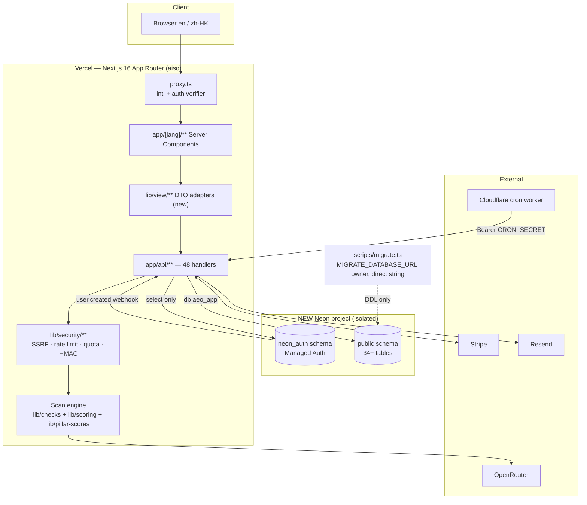
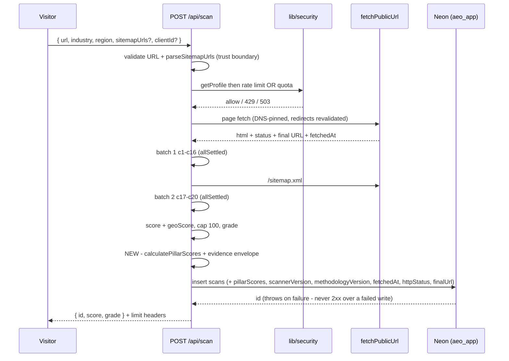
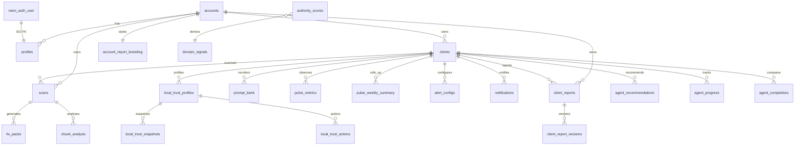
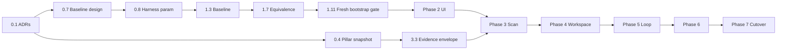

# Integrating the `aisogpt` product design into `aiso` on a new, isolated Neon project

**Status:** Draft for stakeholder review — planning only, no implementation authorised
**Date:** 2026-08-30
**Author:** Claude Code Opus, acting as principal product architect / staff full-stack engineer / database migration lead / security reviewer / delivery planner
**Approval gate:** Sections 24 and 26 must be signed off before any Phase 0 work item starts

## Pinned baselines

| Repository | Default branch | HEAD SHA at analysis time | Resolved | Role |
|---|---|---|---|---|
| `YNWAforever/aiso` | `main` | `f66a8d312fdba1f7b00cd21f187a25838bb81233` | 2026-08-30 via `git ls-remote --symref` | **Canonical production codebase** |
| `YNWAforever/aisogpt` | `main` | `52cbcb4e753e4486afc9af9c3b574948d8e34436` | 2026-08-30 via `git ls-remote --symref` | **UI/product-design donor and route/UX reference** |

Both HEADs are identical to the baselines named in the commissioning specification. No material drift to describe. Both repositories are public; both were inspected from disposable shallow clones under a scratch directory, never from a working checkout.

Every path reference below is relative to its repository root and valid at the SHA above. Permalink form: `https://github.com/YNWAforever/<repo>/blob/<sha>/<path>#L<line>`.

---

## 1. Executive recommendation

**Keep `aiso` as the canonical production repository. Treat `aisogpt` as a design donor only. Bootstrap the new Neon project from a reviewed, clean, schema-only baseline rather than replaying the historical migration chain.**

The evidence is decisive and one-directional:

- `aiso` contains a working 20-check scan engine, SSRF-pinned fetch layer, durable rate limits, quota ledgers, Stripe entitlement resolution, multi-tenant account scoping, a least-privilege database role, 163 test files, a four-job CI merge gate, and a live Vercel deployment. `aisogpt` contains none of these.
- `aisogpt` has **zero API routes**, an **intentionally empty** Drizzle schema (`db/schema.ts` is three comment lines and `export {}`), a Cloudflare D1 binding that is `null` in `.openai/hosting.json`, and a build stack (Vite + Vinext + Wrangler + ChatGPT Sites) that is not Next.js-on-Vercel.
- Reversing the direction would mean re-implementing every security control in a codebase whose own documentation states it makes no network, database, auth, billing, or publishing call.

What `aisogpt` genuinely contributes is **product thinking**: a coherent information architecture (33 public route families, 12 workspace sections, a 7-tab entity model), a disciplined evidence-state vocabulary that separates provenance from collection state from assessment state, a coverage-gated scoring model that refuses to convert missing evidence into zero, and clearer SME-facing bilingual copy. Those are the assets to transplant.

Three findings materially shape the plan and should be read before anything else:

1. **The fresh-project bootstrap blocker is real and confirmed** (§15). `npm run migrate` cannot initialise an empty Neon project. Migration `003` depends on a Supabase-era `auth` schema that no migration creates; migration `022` depends on `neon_auth` existing first. The existing integration harness only works because it branches from the old production branch and inherits both schemas.
2. **The pillar-snapshot gap is real and confirmed** (§13). `lib/pillar-scores.ts` defines a `methodologyVersion` and a stored-snapshot reader, but no code path writes one. Every stored scan silently recalculates its diagnostic pillars against current weights.
3. **`aiso`'s own architecture document is materially out of date in at least eleven places** (§6). Planning from `CLAUDE.md` alone would produce a wrong plan.

Recommended shape: seven phases, ~46 PR-sized work items, greenfield Neon project with fresh identities and no production data copy, existing explicit `account_id` scoping retained for Phase 1 with RLS deferred to a separate security workstream, and the legacy product left running as a separate system rather than retired by this plan.

---

## 2. Scope and explicit non-goals

### In scope

- Porting `aisogpt`'s information architecture, route hierarchy, design tokens, evidence UX, state semantics, and SME copy into `aiso`'s Next.js 16 App Router structure.
- Binding that presentation to `aiso`'s existing services through server-side DTO adapters.
- Standing up a new, isolated Neon project with its own Auth configuration, roles, credentials, and environment/branch topology.
- Closing the scan-credibility gaps: versioned pillar snapshots, scanner/methodology versioning, evidence provenance, and score reproducibility.
- Additive schema slices for the discovery-to-proof loop, added only where a vertical feature genuinely needs them.

### Explicit non-goals

| Non-goal | Rationale |
|---|---|
| Migrating production users, tenants, scans, billing state, or reports | Separately approved workstream; default is fresh tenants (§17, decision 5) |
| Retiring the existing production system | No approved cutover workstream exists; legacy remains a separate system (§21) |
| Adopting Cloudflare D1, Drizzle, or a second data-access stack | `lib/db.ts` remains the single client (§7 ADR-4) |
| Adopting Vite/Vinext/Wrangler/ChatGPT Sites hosting or `.openai/hosting.json` | Target is Next.js 16 on Vercel (§7 ADR-4) |
| Adopting `app/chatgpt-auth.ts` host-auth helpers | Not the Neon Auth model (§17) |
| Copying `app/aiso-app.tsx` or `app/globals.css` wholesale | 335 KB / 125 KB monoliths to decompose, not import (§11) |
| Changing the 100-point AISO headline score | Stable benchmark unless separately approved (§13, decision 7) |
| Changing the Stripe price catalogue or introducing HKD packaging | Donor HKD proposal is review-only (§18, decision 10) |
| Framework, dependency, or UI-primitive upgrades not required by a named work item | Incidental upgrade is out of scope (§7 ADR-4) |
| Enabling load-bearing RLS | Separate security migration with its own verification (§17 ADR-8) |
| Renaming `clientId` to `brandId` in the database | Vocabulary resolved at the DTO boundary only (§9) |

---

## 3. Current-state architecture: `aisogpt`

### 3.1 What it is

A private, noindex review build. `app/layout.tsx` sets `robots: { index: false, follow: false, noarchive: true, nosnippet: true }` and an explicit `"review-build": "demo-data-no-production-connections"` meta tag. `app/robots.ts` disallows everything; `app/sitemap.ts` returns an empty array with the comment that the build is intentionally excluded from discovery. `worker/index.ts` additionally stamps `X-Robots-Tag: noindex, nofollow, noarchive, nosnippet` on every response.

`docs/CODEX_INTEGRATION_HANDOFF.md` states the boundary plainly: the review contains no network adapter, database, auth, billing, analytics, or publishing call, and all transitions are local React state.

### 3.2 Structure

| Concern | File | Size | Note |
|---|---|---|---|
| Catch-all router | `app/[...segments]/page.tsx` | 362 lines | Allow-list dispatcher + redirect table + metadata |
| Application monolith | `app/aiso-app.tsx` | 334,919 bytes / 3,239 lines | Single `'use client'` file, **82 components**, 50 hook calls |
| Global stylesheet | `app/globals.css` | 124,930 bytes | 82 custom properties, 1 `@theme`, 12 `@media`, 3 `@import` |
| Fixtures | `app/fixtures.ts` | 485 lines | Entities, observations, opportunities, claims, questions, scenarios, page copy |
| Product truth | `app/product-truth.ts` | 558 lines | Pillar model, coverage gate, Asia coverage matrix, outcome ledger |
| Scan truth | `app/repo-scan-truth.ts` | 91 lines | Fixed 20-check ledger mirroring `fimmick-aeo@64c3aee` |
| Demo lifecycle | `app/demo-lifecycle.ts` | 300 lines | Guarded approval state machine, schema version 1 |
| Host auth | `app/chatgpt-auth.ts` | 86 lines | ChatGPT-host helpers — **excluded from adoption** |
| DB scaffold | `db/schema.ts` | 3 lines | `export {}` — intentionally empty |
| DB client | `db/index.ts` | 13 lines | Cloudflare D1 via `drizzle-orm/d1`; throws if binding absent |
| Worker | `worker/index.ts` | ~130 lines | Vinext entry, image optimisation, response policy, `/r/revoked` + `/r/expired` → HTTP 410 |
| Primitives | `components/ui/*.tsx` | **61 files** | shadcn/Base UI/Radix set |

### 3.3 Stack

Next 16.2.6 / React 19.2.6 built by **Vite 8 + `@vitejs/plugin-rsc` + Vinext 0.0.50**, deployed as a **Cloudflare Worker** via Wrangler 4.92, hosted under a ChatGPT Sites project (`.openai/hosting.json` → `project_id: appgprj_…`, `d1: null`, `r2: null`). Dependencies not present in `aiso`: `@base-ui/react`, `radix-ui` (umbrella), `cmdk`, `vaul`, `sonner`, `react-hook-form`, `@hookform/resolvers`, `zod`, `date-fns`, `embla-carousel-react`, `react-day-picker`, `input-otp`, `react-resizable-panels`, `next-themes`, `drizzle-orm`, `tw-animate-css`.

### 3.4 Tests

Four Node test files (`tests/*.test.mjs`) covering demo lifecycle, product truth, rendered HTML, and UI components. `npm test` runs `npm run build && node --test tests/*.test.mjs`. There is no CI workflow in the repository.

### 3.5 Concepts worth taking

| Concept | Source | Value |
|---|---|---|
| Three-axis state vocabulary (provenance / collection / assessment, confidence separate) | `docs/PRODUCT_UX_SYSTEM.md`, `app/product-truth.ts:11-24` | Prevents a single badge from overloading "we didn't check" with "it failed" |
| Coverage gate: score suppressed below 0.67 weighted coverage; provisional below 0.85 | `app/product-truth.ts:66-69`, `calculatePillarScore()` | Missing evidence lowers coverage, never becomes a zero |
| `not_applicable` leaves both numerator and denominator | `app/product-truth.ts:172-176` | Correct handling of genuinely inapplicable checks |
| Outcome windows D7/D28/D56 derived from actual delivery date | `deriveOutcomeWindowDates()` | Proof model anchored to real delivery, not scheduling |
| Guarded lifecycle transitions with block reasons | `app/demo-lifecycle.ts:124-236` | Approval workflow shape with explicit refusal semantics |
| Owner lens (`reachable` / `understandable` / `trustworthy`) over the 20 checks | `app/repo-scan-truth.ts:13` | SME-comprehensible grouping of an engineer-shaped check list |
| Release-state matrix separating `Demo` from `Planned` | `ASIA_DEMO_COVERAGE_MATRIX` | Honest capability labelling |

### 3.6 Concepts that must NOT be taken as fact

`app/repo-scan-truth.ts` is a **fixed fictional ledger** — its header says so. `calculateRepoScanResult()` produces a coverage-gated score from hard-coded check states. It is not a scan engine. `ASIA_DEMO_COVERAGE_MATRIX` marks Singapore coverage as a *provider-failure fixture* that "supports no visibility conclusion", and Cantonese/code-switch/Japanese as `not_implemented`. `docs/PRICING_ENTITLEMENT_AND_PRODUCT_TRUTH_REVIEW.md`'s HKD table is labelled a review concept that cannot start checkout.

---

## 4. Current-state architecture: `aiso`

### 4.1 Stack (verified against `package.json`)

Next.js **16.2.4** App Router, React 19.2.5, TypeScript 5.9.3, Node **24.x** (`engines`), `next-intl` 4.9, Tailwind 4, Radix Slot + shadcn (6 primitives), Recharts 3.8, `@neondatabase/serverless` 1.1, `@neondatabase/auth` **0.4.2-beta (pinned exact)**, Stripe 22, Resend 6, Vitest 4, Playwright 1.60. Deployed on Vercel (`vercel.json`).

### 4.2 Routing

`proxy.ts` (Next 16's renamed middleware) runs `next-intl` routing, with one exception: when **both** the `neon_auth_session_verifier` query param **and** the `__Secure-neon-auth.session_challange` cookie are present, it delegates to the SDK middleware. Matcher `['/((?!api|admin|_next|.*\\..*).*)']` excludes `/api` and top-level `/admin`.

`i18n/routing.ts`: `locales: ['en', 'zh-HK']`, **`defaultLocale: 'en'`**.

`next.config.ts` declares two permanent redirects (`/pricing` → `/en/pricing`, `/auth/login` → `/en/auth/login`) that fire *before* `proxy.ts`, plus a `headers()` rule applying `PUBLIC_REPORT_SECURITY_HEADER_VALUES` to `/:lang(en|zh-HK)/r/:slug`.

**21 filesystem page routes**, **48 API route files**, 7 layouts/special files (`app/robots.ts`, `app/sitemap.ts`, one `opengraph-image.tsx`, one `not-found.tsx`).

### 4.3 Auth model

No global gate. Three enforcement sites, all through `lib/auth.ts`:

1. Route-group layouts — `app/[lang]/dashboard/layout.tsx` → `requireAuth(lang)`; `app/admin/layout.tsx` → `requireAdmin()`.
2. Per-page outside those subtrees — e.g. `app/[lang]/admin/authority/page.tsx`.
3. Per-route-handler — each handler gates itself or delegates to a verified service guard.

`getProfile()` (`lib/auth.ts:6`) joins `profiles` to `accounts` and returns `null` for unauthenticated callers rather than throwing.

The canonical guard shape is `lib/localTrust/guard.ts`: **authentication → entitlement → ownership**, in that order, in one place. Ownership failure returns 404 (the id came from the caller); a failed ownership *lookup* returns 503 so a database incident cannot read as "not yours". `lib/prompts/guard.ts` deliberately omits ownership because every mutation carries `clients.account_id = $n` inside its own statement, eliminating the TOCTOU window.

### 4.4 Scan engine

`app/api/scan/route.ts` (374 lines) runs 20 checks in **two sequential `Promise.allSettled` batches**: c1–c16 after a blocking page fetch, then c17–c20 after a `/sitemap.xml` fetch feeding c19. Every network check receives an injected `fetchPublicUrl` (`lib/security/public-url.ts`) that pins DNS and revalidates every redirect hop against a private-range blocklist including `169.254.0.0/16`.

Scoring (`lib/scoring.ts`): Core 45 (c1–c5) + Extended 30 (c6–c16) + GEO 25 (c17–c20) = 100. `scorePts` awards full weight on `pass`, half on `warn`, zero on `fail`. Composition is **not** centralised: the route computes `Math.min(100, score + geoScore)` inline and `lib/impact.ts` duplicates the same cap.

### 4.5 Database

Neon Postgres. `lib/db.ts` is a lazy `@neondatabase/serverless` singleton exposing tagged-template queries only. 35 migration files in `supabase/migrations/` numbered `001`–`037` (no 005/006; directory name is legacy). **34 application tables.**

Application connects as **`aeo_app`** (migration `037`): blanket DML on `public`, `USAGE`/`SELECT` on sequences, `SELECT` on `neon_auth."user"`, default privileges for future tables, and **`BYPASSRLS` deliberately retained** because seven tables carry RLS-enabled/zero-policy default-deny posture and a non-bypass role would return zero rows silently. Migrations run through a separate `MIGRATE_DATABASE_URL` owner connection with **no fallback** (`scripts/migrate.ts:187`).

Migration `036` dropped all 30 Supabase-era policies and disabled RLS on 21 tables. **There is no database-level tenancy backstop** — every query must filter by `account_id` explicitly.

### 4.6 Jobs and integrations

Scheduling lives in `cloudflare/cron-worker/wrangler.jsonc`: `17 4 * * 1` → `/api/cron/pulse`, `47 7 * * 1` → `/api/cron/evaluate-alerts` (deliberately after pulse, because alerts read the rollup pulse writes), `0 9 * * *` → `/api/cron/trial-emails`. `vercel.json` sets `maxDuration` per function but schedules nothing. `APP_BASE_URL` is hard-coded to the production origin in `wrangler.jsonc`.

`n8n/` holds three workflow exports. `ai-pulse-weekly-v2.json` (20 nodes) queries four LLM providers and writes `pulse_metrics` through raw Postgres nodes; `aiso-scan-webhook.json` (8 nodes) updates `scans`. Every workflow references a credential literally named **`Supabase Postgres`**.

### 4.7 Tests and CI

163 test files (`__tests__/`), 9 integration tests, 6 Playwright specs with page objects. `.github/workflows/pr-gate.yml` runs four jobs — `static`, `unit-contract`, `e2e-accessibility`, `build` — aggregated by `scripts/ci/aggregate-gate.mjs` against `ci/pr-gate-manifest.json`.

**CI does not run integration tests.** The workflow contains no reference to `neonctl`, `NEON_API_KEY`, `REQUIRE_INTEGRATION_TESTS`, or `SKIP_INTEGRATION_TESTS`. `scripts/run-tests.mjs:123-151` skips the integration project when `neonctl` is unavailable, printing a banner. A skip is not a pass.

---

## 5. Evidence and source-of-truth hierarchy

Applied throughout this plan, highest confidence first:

1. Executable source, SQL migrations, `package.json`/`package-lock.json`, `vercel.json`/`wrangler.jsonc`, `.github/workflows/`, passing contract tests.
2. `AGENTS.md`, `CLAUDE.md`, `docs/runbooks/`.
3. `docs/product/geo-aeo-seo-roadmap.md` and dated design docs — direction, not proof.
4. Historical plans, stale comments, README prose, marketing copy, demo fixtures.

### 5.1 Capability-status matrix

`Impl` = code exists. `Test` = test file exists. `CI@SHA` = covered by the merge gate at the pinned SHA. `Deployed` = configured in deployment config. `Runtime` = verified running in production. `?` = unknown, no evidence available to this analysis.

| Capability | Impl | Test | CI@SHA | Deployed | Runtime | Evidence |
|---|---|---|---|---|---|---|
| 20-check scan engine | Yes | Yes | Yes | Yes | Yes | `app/api/scan/route.ts`; `__tests__/checks/*`; `vercel.json` maxDuration 60 |
| SSRF-pinned fetch | Yes | Yes | Yes | Yes | ? | `lib/security/public-url.ts`; `__tests__/api/scan-security.test.ts` |
| Public scan rate limit | Yes | Yes | Yes | Yes | ? | `lib/security/public-scan-rate-limit.ts` (5 / 600 s); requires `VERCEL=1` |
| Authenticated scan quota | Yes | Yes | Yes | Yes | ? | `lib/security/authenticated-scan-quota.ts` (basic = 3/mo) |
| Headline 0–100 score + grade | Yes | Yes | Yes | Yes | Yes | `lib/scoring.ts` |
| **Diagnostic pillar snapshot persisted** | **No** | Partial | Partial | n/a | **No** | `lib/pillar-scores.ts` has no writer — see §13.2 |
| Scanner / methodology version on scan | **No** | No | No | n/a | No | Absent from `scans` insert |
| Evidence excerpt / fetched-at / final URL | **No** | No | No | n/a | No | Absent from `scans` insert |
| Bounded multi-page crawl | **No** | No | No | n/a | No | Roadmap P1 only |
| Neon Auth sign-in | Yes | Yes | Yes | Yes | Yes | `lib/neon-auth.ts`, `proxy.ts`, `components/auth/AuthComplete.tsx` |
| Neon user webhook provisioning | Yes | Yes | Yes | ? | ? | `app/api/webhooks/neon/route.ts`; advisory-lock serialised |
| Stripe checkout / portal / webhook | Yes | Yes | Yes | Yes | Yes | `app/api/stripe/*`; `__tests__/integration/stripe-webhook-lifecycle.test.ts` |
| Entitlement resolution | Yes | Yes | Yes | Yes | Yes | `lib/tier.ts:109`; manifest `ENTITLEMENT-P0` |
| Least-privilege `aeo_app` role | Yes | Yes | **No** (integration-only) | Yes | Yes | `037`; `__tests__/integration/least-privilege-role.test.ts` |
| Client reports + public share links | Yes | Yes | Yes | ? | ? | `lib/reports/*`; HMAC via `REPORT_SHARE_SECRET` |
| Local Trust | Yes | Yes | Yes | ? | ? | `lib/localTrust/*` |
| AI Pulse weekly rollup | Yes | Yes | Yes | Yes | **No — never written a row** | `CLAUDE.md`: `prompt_bank` empty → `selectPendingClients` returns none |
| Alert evaluation | Yes | Yes | Yes | Yes | ? | `lib/alerts/*`; scheduled `47 7 * * 1` |
| Cloudflare cron worker | Yes | Yes | Config present | ? | ? | Deploy is a manual runbook step |
| Fix Pack / content tools | Yes | Yes | Yes | Yes | ? | `app/api/fix/*` |
| Agents (recs/progress/competitors) | Yes | Yes | Yes | ? | ? | Restored 2026-08-23 |
| Notifications | Yes | Yes | Yes | ? | ? | Restored 2026-08-21 |
| Domain authority engine | Yes | Yes | Yes | ? | ? | `lib/authority/*` (4 layers) |
| GSC / Bing / analytics / CMS | **No** | No | No | No | No | Roadmap P1 |
| Discovery / opportunities / approvals / proof | **No** | No | No | No | No | Donor fixtures only |

### 5.2 Evidence ledger (selected)

| # | Claim | Direct evidence | Type |
|---|---|---|---|
| E1 | Both HEADs match pinned baselines | `git ls-remote --symref`, 2026-08-30 | Direct |
| E2 | `003` depends on a `auth` schema no migration creates | `003_phase3a_accounts.sql:15,33,35,42,48` | Direct |
| E3 | `022` requires `neon_auth.user` to pre-exist | `022_profiles_neon_auth_fk.sql:1-11` | Direct |
| E4 | Harness relies on inherited schemas from the old project | `__tests__/integration/setup.ts:13-58` | Direct |
| E5 | Old project/branch/role hard-coded | `__tests__/helpers/neon-branch.ts:7,14,22` | Direct |
| E6 | No writer for `results.pillarScores` | Repo-wide grep; `app/api/scan/route.ts:303` | Direct |
| E7 | 33 donor public families / 12 sections / 5 entities / 7 tabs / 30 exact redirects | Parsed from `app/[...segments]/page.tsx` | Direct |
| E8 | Donor D1 schema intentionally empty | `db/schema.ts` | Direct |
| E9 | CI omits integration tests | `.github/workflows/pr-gate.yml` (no `neonctl`/`NEON_API_KEY`) | Direct |
| E10 | n8n credential named `Supabase Postgres` | `n8n/*.json` `credentials.postgres.name` | Direct |
| E11 | Neon Auth stores identity in `neon_auth`, branches with the database, AWS regions only | Neon docs, Auth overview, accessed 2026-08-30 | Direct (external) |
| E12 | Neon Auth publishes an `x-webhook-signature` header for webhook verification | Neon Auth AsyncAPI spec, accessed 2026-08-30 | Direct (external) |
| E13 | Neon pooler is PgBouncer in transaction mode; DDL/session state needs the direct string | Neon connection-pooling docs, accessed 2026-08-30 | Direct (external) |
| E14 | Neon supports schema-only branching | Neon branching docs, accessed 2026-08-30 | Direct (external) |
| E15 | Donor monolith is 82 components in one `'use client'` file | `app/aiso-app.tsx` parsed | Direct |
| I1 | Reverse migration is higher risk | Inference from E8 + donor route/API absence | **Inference** |
| I2 | Historical scans have drifted | Inference from E6 + `PILLAR_SCORE_VERSION` | **Inference** |

---

## 6. Documentation drift

Every row is a real contradiction found at the pinned SHA. Left uncorrected, each one would mislead an implementer.

| # | Conflicting statements | Higher-confidence evidence | Operational consequence | Cleanup task |
|---|---|---|---|---|
| D1 | `.env.example` says `RESEND_API_KEY` — "`sendAlertEmail()` has zero callers; alerting is fenced". `CLAUDE.md` says alert evaluation is Neon-backed, scheduled, and consumes `RESEND_API_KEY`. | `lib/alerts/`, `cloudflare/cron-worker/wrangler.jsonc` | An operator provisioning a new environment omits a now-required secret; alert email silently fails | PR-0.2 |
| D2 | `.env.example` says `cron/trial-emails` and `cron/evaluate-alerts` "are still 503 stubs and read nothing". `CLAUDE.md` says both were restored. | Route files export `GET`; worker schedules both | Same class as D1 | PR-0.2 |
| D3 | `.env.example` says Vercel Cron calls `/api/cron/pulse`. `vercel.json` has no `crons` array. | `vercel.json`; `wrangler.jsonc` | Operator believes scheduling is automatic; nothing fires until the worker is deployed | PR-0.2 |
| D4 | `CLAUDE.md` says "33 SQL migrations, 001_-035_" in one place and "35 files, `001_`–`037_`" in another. | 35 files, `001`–`037` | Baseline/verify reasoning off by two migrations | PR-0.2 |
| D5 | `CLAUDE.md` says the remote is `github.com/YNWAforever/fimmick-aeo`. | Canonical repo is `YNWAforever/aiso` | Permalinks and CI references point at the wrong origin | PR-0.2 |
| D6 | `CLAUDE.md` says "`@neondatabase/auth` ships no webhook signing, so that lookup is the only authentication it has." | Neon Auth AsyncAPI documents `x-webhook-signature` (E12) | A **security improvement is being left on the table**; the `neon_auth.user` lookup is a weaker control than HMAC verification | PR-0.6 (verify against the pinned SDK version before changing anything) |
| D7 | `021`'s own header says "This migration has never been applied". `CLAUDE.md` says `--verify` on 2026-08-15 reports it applied. | `--verify` output cited in `CLAUDE.md` | Re-applying `021` would fail on existing objects | PR-0.2 |
| D8 | `.env.example` lists `NEXT_PUBLIC_STRIPE_PUBLISHABLE_KEY` as dead, yet `@stripe/stripe-js` ^9.3.1 is a dependency. | No source imports it | Dead dependency in the client bundle budget | PR-2.1 |
| D9 | `package.json` lint ignores `.worktrees/`, `.codex/`, `.opencode/`; `CLAUDE.md` says these are vestigial. Same dead paths in `tsconfig.json` and `vitest.config.ts`. | Directories absent | Confusing config; no functional impact | PR-0.2 |
| D10 | Donor `docs/SOURCE_SITE_AUDIT_AND_ROUTE_PARITY.md` describes workspace routes as `/dashboard/{brandId}/…`. The implementation hard-codes `/dashboard/demo/…` and validates against a 5-id allow-list. | `app/[...segments]/page.tsx` `isAllowedWorkspacePath()` | Reading the doc as a route spec produces a wrong parity matrix | Recorded in §9 |
| D11 | Donor doc says legacy paths map to canonical workspaces including `settings`. `exactLegacyRedirects` has no `/settings` key — only `/dashboard/settings`. | Parsed redirect table | Missing redirect if implemented from the doc | Recorded in §9 |
| D12 | `worker/index.ts` returns HTTP 410 for `/r/revoked` and `/r/expired`. **No donor document mentions these routes.** | `worker/index.ts` | Two real behaviours absent from every route inventory | Recorded in §9 |
| D13 | `docs/product/geo-aeo-seo-roadmap.md` Phase 0 says "Ship SEO, AEO and GEO diagnostic pillar scores" as if complete. | Pillars compute but never persist (E6) | Roadmap read as done; historical drift unaddressed | §13 |

---

## 7. ADR set

### ADR-1 — Canonical repository: `aiso`

**Decision.** `aiso` is the canonical production repository. `aisogpt` is a read-only design donor.

**Quantified alternative.** Making `aisogpt` canonical would require porting, at minimum: 48 API route handlers, 35 SQL migrations across 34 tables, the SSRF fetch layer, two rate-limit/quota subsystems, Stripe checkout/portal/webhook plus entitlement resolution, Neon Auth integration including the `proxy.ts` verifier/challenge subtlety, the reports service and HMAC share-link signing, 163 test files, a four-job CI gate, and a Vercel deployment — into a repository that today has **zero** API routes, an **empty** database schema, a `null` D1 binding, and a Vite/Vinext/Wrangler/ChatGPT-Sites build. Every security control would be re-derived rather than preserved.

**Consequences.** Donor code is decomposed, not imported. Donor stack choices (D1, Drizzle, Vinext, ChatGPT-host auth) are excluded. The 61-primitive donor UI library is adopted selectively (ADR-3).

**Approval gate:** decision 1.

### ADR-2 — Routing and locale

**Decision.** Map the donor IA into real `app/[lang]/**` segments. Keep `proxy.ts` as the only request-routing file. Do **not** adopt a catch-all as the production route architecture.

**Rationale.** The donor catch-all exists because a review build needs 120 URLs without 120 files. In production it would defeat static analysis, per-route metadata, per-route `maxDuration`, per-route caching, and Server Component boundaries, and would force everything into one `'use client'` tree.

**Unresolved conflict requiring a decision.** `i18n/routing.ts` sets `defaultLocale: 'en'`; the donor defaults unprefixed paths to `zh-HK` (`app/page.tsx` renders `initialPath="/zh-HK"`, and all 30 `exactLegacyRedirects` target `/zh-HK/…`). These are incompatible. Recommended default: **keep `en`** as `defaultLocale` to preserve existing deep links and the two `next.config.ts` redirects, and treat the donor's zh-HK-first behaviour as a review-build choice. If the business wants zh-HK first in production, that is a separate, explicitly approved change with its own redirect and canonical/hreflang plan.

**Approval gate:** decision 11.

### ADR-3 — Component and design system

**Decision.** Extract donor **tokens** into `app/globals.css` under Tailwind 4's `@theme`. Reuse `aiso`'s existing 6 primitives first. Add a donor primitive only when a named work item needs it, one PR at a time, with a bundle-budget check.

**Rationale.** `aiso` has 6 primitives; `aisogpt` has 61 plus 13 new runtime dependencies. Wholesale adoption is roughly a 10× increase in primitive surface for a UI port, and would introduce a second overlapping primitive system (`@base-ui/react` + `radix-ui` umbrella alongside `@radix-ui/react-slot`).

**Consequences.** Some donor screens need a primitive built or adopted before they can be ported; that dependency is explicit in each work item.

### ADR-4 — Runtime and dependencies

**Decision.** Node 24.x, Next 16.2.4, npm, Vercel, `@neondatabase/serverless` as the only DB driver, `lib/db.ts` as the only client. No Drizzle. No D1. No Vite/Vinext/Wrangler for the application. No framework upgrade inside a UI-port PR.

**Note.** `cloudflare/cron-worker/` keeps its own toolchain — it is already excluded from the root `tsconfig.json`, `vitest.config.ts`, and lint.

### ADR-5 — API and view-model adapters

**Decision.** Introduce a `lib/view/` layer of **server-side** DTO adapters that convert `aiso` domain models into the donor's view contracts. Components receive DTOs, never raw rows.

**Rationale.** The donor's contracts (entity/observation/opportunity/change-set/outcome) are, in its own words, "fixture-compatible view contracts, not a new system of record". An adapter layer lets the new UI land against real data without a schema rewrite, and gives one place to enforce redaction.

**Vocabulary rule.** The donor says `brandId`; the database says `client_id`. **Resolve at the DTO boundary only.** No database identifier is renamed. Where a URL segment must be chosen, keep `[clientId]` to preserve deep links, and let the UI label it "brand".

### ADR-6 — Scoring and methodology

**Decision.** Preserve the 100-point headline score and `assignGrade` thresholds unchanged. Version the diagnostic pillars, persist a snapshot per scan, and never sum SEO/AEO/GEO.

**Two competing pillar models must be reconciled.** `lib/pillar-scores.ts` defines `seo`/`aeo`/`geo` as re-weightings of the same 20 checks, with **no coverage gate**. `app/product-truth.ts` defines `site_health`/`answer_readiness`/`citation_readiness` over 16 new metrics, **with** a coverage gate. Recommended: **keep the target's `seo`/`aeo`/`geo` pillars and check basis** (they are computable from real data today) and **adopt the donor's coverage-gate semantics** into them, so missing evidence lowers coverage rather than scoring as fail. The donor's pillar *names* become UI labels only if the business prefers them; that is cosmetic and separable.

**Consequence.** `calculatePillar()` currently coerces a missing result to `{ status: 'fail' }` via `asCheckResult()`. That is exactly the "missing data becomes zero" failure the donor model rejects. Fixing it changes pillar numbers for scans with incomplete results and must ship behind the version bump.

**Approval gate:** decision 7.

### ADR-7 — Greenfield Neon bootstrap

**Decision.** **Option A — clean greenfield baseline.** Full comparison in §15.

### ADR-8 — Tenant isolation and RLS

**Decision.** Phase 1 preserves the current model: least-privilege `aeo_app` + explicit `account_id` filtering + contract tests. RLS redesign is deferred to a separate, separately approved security workstream.

**Rationale.** `036` removed 30 policies precisely because they were inert and silently hazardous (`auth.uid()` returns NULL under Neon because nothing sets the GUC). Re-introducing RLS requires a session-identity mechanism that does not exist yet, plus removing `aeo_app`'s `BYPASSRLS`, plus policies on all 34 tables, plus performance testing. Combining that with a UI port would make both unreviewable.

**Non-negotiable.** `__tests__/migrations/rls-policy-freeze.test.mjs` must continue to fail if a migration after `035` creates a policy. The greenfield baseline must reproduce this posture exactly, including the seven RLS-enabled/zero-policy tables.

**Approval gate:** decision 6.

### ADR-9 — Neon Auth and identity

**Decision.** The new project starts with **fresh identities**. No user migration in this plan.

**Generation check.** `@neondatabase/auth` is pinned at `0.4.2-beta`. The application reads `neon_auth."user"` (`app/api/webhooks/neon/route.ts:122`) and `profiles.id` FKs to `neon_auth.user` (`022`), which is the **Better Auth** table shape, not the legacy Stack Auth `neon_auth.users_sync` shape. Conclusion: `aiso` is already on the current Neon Auth generation, so no legacy-to-managed migration applies. **Verify this against the installed `node_modules/@neondatabase/auth` and current Neon docs at implementation time before relying on it.**

**Region constraint.** Neon Auth is documented as AWS-regions-only. The new project's region choice is therefore constrained (§16.1).

**Ordering consequence.** Because Auth provisions `neon_auth` and the baseline FKs into it, **Auth must be enabled on the new production branch before the baseline runs**. Because Auth state branches with the database, staging/preview branches inherit an Auth configuration and need their own issuer/cookie/callback isolation (§17).

**Approval gate:** decision 4.

### ADR-10 — Async jobs and automation

**Decision.** Cloudflare Worker owns scheduling. `pulse/run` stays the in-app producer. **n8n Pulse workflows are retired**, not migrated.

**Rationale.** `ai-pulse-weekly-v2.json` and `pulse/run` both write `pulse_metrics`, a table with **no unique key**, where `total_queries` in the weekly rollup is a row count. Two writers means inflated `sov_score` — the headline number of the feature — plus duplicate LLM spend across four providers. `pulse/run` defends itself by deleting a prompt's rows for the week before writing, in application code; the n8n workflow has no such discipline.

**Retained decision.** `aiso-scan-webhook.json` is fire-and-forget enrichment; retire or re-point it deliberately, not by omission.

**Approval gate:** decision 9.

### ADR-11 — Cutover

**Decision.** Dark launch behind flags, route-slice rollout, synthetic/internal-only canary, no dual-write, legacy system **not** retired by this plan.

**Write-fence rule.** Before the first real business write: exactly one system of record per tenant and data class; unplanned dual-write prohibited by default; reconciliation defined; rollback handling for new writes defined.

**Approval gates:** decisions 11, 12.

---

## 8. Target system context

### Scan request flow with the new evidence contract

---

## 9. Route manifests, reconciliation, and parity matrix

### 9.1 Canonical manifests

**Manifest A — `aiso` filesystem page routes (21).**
`app/page.tsx`, `app/admin/page.tsx`, `app/[lang]/page.tsx`, `[lang]/pricing`, `[lang]/onboarding`, `[lang]/auth/{login,logout,complete,google}`, `[lang]/dashboard`, `[lang]/dashboard/settings`, `[lang]/dashboard/[clientId]`, `…/[clientId]/prompts`, `…/[clientId]/result/[scanId]`, `…/[clientId]/reports`, `…/reports/new`, `…/reports/[reportId]`, `[lang]/pulse/[clientId]`, `[lang]/result/[id]`, `[lang]/r/[slug]`, `[lang]/admin/authority`. Plus `app/robots.ts`, `app/sitemap.ts`, `app/[lang]/result/[id]/opengraph-image.tsx`, `app/[lang]/r/[slug]/not-found.tsx`.

**Manifest B — `aiso` API method+path (48 files, 57 method+path combinations).** Full gate detail in §12.1.

**Manifest C — donor virtual routes (parsed from the dispatcher, not documentation).**

| Set | Count | Source |
|---|---|---|
| `publicRoutes` families | 33 | `app/[...segments]/page.tsx` |
| Public concrete URLs (× 2 locales) | 66 | `locales = {zh-HK, en}` |
| `workspaceSections` | 12 | dispatcher |
| `demoEntityIds` | 5 | dispatcher |
| `entityTabs` | 7 | dispatcher |
| Workspace concrete URLs | 54 | `/dashboard/demo` + `/dashboard/portfolio` + 12 + 5 + (5 × 7) |
| **Total canonical virtual URLs** | **120** | 66 + 54 |
| `exactLegacyRedirects` | 30 | dispatcher |
| `temporaryLegacyRedirects` | 1 | `/r/demo` → `/zh-HK/sample-report` |
| `localisedLegacyCapabilities` × 2 locales | 8 | 4 keys (`foundation`, `answer-readiness`, `citation-readiness`, `ai-pulse`) |
| `localisedRouteAliases` × 2 locales | 4 | 2 keys |
| `legacyWorkspaceSections` | 4 | regex-driven family (`fixes`, `pulse`, `prompts`, `result`) |
| Worker-level responses | 2 | `/r/revoked`, `/r/expired` → HTTP 410 (**undocumented**) |

**Reconciliation.** The matrix in §9.2 carries **49 rows**: 33 donor public families + 16 workspace families (`/dashboard/demo`, `/dashboard/portfolio`, 12 sections, `entities/[entityId]`, `entities/[entityId]/[tab]`). Locale variants are collapsed into one row per family and are **not** double-counted; 33 × 2 = 66 and 16 families → 54 concrete workspace URLs are accounted for by the family rows. Redirects are handled in the "Redirect/compatibility rule" column rather than as separate rows. Intentional exclusions, itemised: `/result/demo-scan` (aliased to `/result/demo`, no independent page), `/platform/search-visibility` (alias only, never in `publicRoutes`), `/handoff` (donor doc states it is not exposed), and the 5 concrete demo entity ids (fixture data, not routes).

### 9.2 Route parity matrix

Target actions: `reuse` · `restyle` · `port-onto-data` · `adapter` · `new-api` · `new-schema` · `redirect` · `fixture-only` · `defer` · `retire`.

| Surface | Donor route | Donor component | Existing `aiso` route | Existing API/service | Gate | Current data source | Target action | Redirect / compatibility | Phase | Acceptance test |
|---|---|---|---|---|---|---|---|---|---|---|
| Home | `/{loc}` | `HomePage` | `app/[lang]/page.tsx` | `POST /api/scan` | public | live | port-onto-data | none | 2 | E2E home + scan submit, both locales |
| Platform overview | `/{loc}/platform` | `PlatformOverview` | — | — | public | static | new page (restyle) | none | 2 | Playwright render + axe |
| Search intelligence | `/{loc}/platform/search-intelligence` | `CapabilityPage` | — | — | public | static | new page | `/platform/search-visibility` → 308 | 2 | render + redirect assert |
| Site health (public) | `/{loc}/platform/site-health` | `CapabilityPage` | — | — | public | static | new page | `/foundation` → 308 | 2 | render + redirect |
| Demand intelligence | `/{loc}/platform/demand-intelligence` | `CapabilityPage` | — | — | public | static | new page | `/answer-readiness` → 308 | 2 | render + redirect |
| Brand/product discovery | `/{loc}/platform/brand-product-discovery` | `CapabilityPage` | — | — | public | static | new page | none | 2 | render |
| AI visibility (public) | `/{loc}/platform/ai-visibility` | `CapabilityPage` | — | — | public | static | new page | `/citation-readiness`, `/ai-pulse` → 308 | 2 | render + 2 redirects |
| Action Studio (public) | `/{loc}/platform/action-studio` | `CapabilityPage` | — | — | public | static | new page | none | 2 | render |
| Governed agents | `/{loc}/platform/governed-agents` | `GovernedAgentsPage` | — | — | public | static | new page — **label Planned** | none | 2 | render + release-state assert |
| Proof (public) | `/{loc}/platform/proof` | `CapabilityPage` | — | — | public | static | new page | none | 2 | render |
| Solutions index | `/{loc}/solutions` | `SolutionsOverview` | — | — | public | static | new page | none | 2 | render |
| Solutions: SME | `/{loc}/solutions/sme` | `SolutionPage` | — | — | public | static | new page | none | 2 | render |
| Solutions: agencies | `/{loc}/solutions/agencies` | `SolutionPage` | — | — | public | static | new page | none | 2 | render |
| Solutions: enterprise | `/{loc}/solutions/enterprise` | `SolutionPage` | — | — | public | static | new page | none | 2 | render |
| Solutions: regulated | `/{loc}/solutions/regulated-industries` | `SolutionPage` | — | — | public | static | new page | none | 2 | render |
| How it works | `/{loc}/how-it-works` | `HowItWorks` | — | — | public | static | new page | `/how-it-works` → localised | 2 | render |
| Scan | `/{loc}/scan` | `ScanJourney` | home form (`components/home/ScanForm.tsx`) | `POST /api/scan` | public + rate limit | live | port-onto-data | `/scan` → localised | 3 | E2E scan, 429 path, error states |
| Result | `/{loc}/result/demo` | `ScanResult` | `app/[lang]/result/[id]` | `lib/result-access.ts` | public/signed | live | port-onto-data | `/result/demo-scan` → `/result/demo`; keep `/result/[id]` | 3 | legacy result renders; deep link |
| Discover | `/{loc}/discover` | `DiscoveryJourney` | — | **none** | public | fixture | fixture-only → defer | none | 5 | fixture labelled Demo |
| Entity profile (public) | `/{loc}/discover/hk/harbour-brew-one` | `PublicEntityProfile` | — | **none** | public | fixture | defer — needs ownership verification policy | none | 5+ | blocked until §18 policy |
| Sample report | `/{loc}/sample-report` | `SampleReportPage` | `app/[lang]/r/[slug]` | `lib/reports/public.ts` | signed | live | port-onto-data | `/r/demo` → 307 **temporary** (revocable) | 4 | revoked/expired states |
| Resources | `/{loc}/resources` | `ResourcesPage` | — | — | public | static | new page | none | 2 | render |
| Integrations (public) | `/{loc}/integrations` | `IntegrationsPage` | — | — | public | static | new page — **release states** | `/integrations` → workspace | 2 | release-state assert |
| Methodology | `/{loc}/methodology` | `MethodologyPage` | — | — | public | static | **new page — required by §13** | none | 3 | weights/version published |
| Security | `/{loc}/security` | `TrustPage` | — | — | public | static | new page | none | 2 | render |
| Trust | `/{loc}/trust` | `TrustPage` | — | `lib/product-facts.ts` | public | mixed | port-onto-data | none | 2 | runtime truth, not copy |
| Pricing | `/{loc}/pricing` | `PricingPage` | `app/[lang]/pricing` | `lib/plans/catalog.ts` | public | live | restyle **only** | `/pricing` → `/en/pricing` (exists) | 2 | prices from catalog, not markup |
| Privacy | `/{loc}/privacy` | `LegalSummary` | — | — | public | static | new page — **legal sign-off** | none | 2 | approved copy only |
| Terms | `/{loc}/terms` | `LegalSummary` | — | — | public | static | new page — **legal sign-off** | none | 2 | approved copy only |
| Contact | `/{loc}/contact` | `ContactHandoffPage` | — | — | public | static | new page | none | 2 | render |
| Login | `/{loc}/auth/login` | `LoginPage` | `app/[lang]/auth/login` | `/api/auth/[...path]` | public | live | restyle only | `/auth/login` → `/en/auth/login` (exists) | 4 | magic-link + verifier/challenge paths |
| Demo launcher | `/{loc}/demo` | `DemoLauncher` | — | — | public | fixture | fixture-only, **non-production** | none | — | must not ship to prod routes |
| Workspace home | `/dashboard/demo` | `OutcomeHome` | `app/[lang]/dashboard/[clientId]` | `/api/clients/[clientId]/overview` | auth+own | live | port-onto-data | `/dashboard` → `/{loc}/dashboard` | 4 | ownership + cross-account denial |
| Demand | `…/demand` | `DemandWorkspace` | `…/[clientId]/prompts` | prompts API | auth+ent+own | live | port-onto-data | `prompts` → `demand` | 4 | read/write entitlement asymmetry |
| Entity portfolio | `…/entities` | `EntityPortfolio` | — | **none** | auth | fixture | new-schema | none | 5 | tenant isolation |
| Entity overview | `…/entities/[id]/overview` | `EntityOverview` | — | none | auth | fixture | new-schema | none | 5 | isolation |
| Entity questions | `…/questions` | `QuestionWorkspace` | `prompt_bank` (partial) | prompts API | auth+ent | partial | adapter + extend | none | 5 | isolation |
| Entity evidence | `…/evidence` | `ObservationWorkspace` | — | none | auth | fixture | new-schema | none | 5 | provenance labelling |
| Entity sources | `…/sources` | `SourceWorkspace` | — | none | auth | fixture | new-schema | none | 5 | isolation |
| Entity pages | `…/pages` | `PageTruthWorkspace` | — | none | auth | fixture | new-schema | none | 5 | isolation |
| Entity actions | `…/actions` | `OpportunityBoard` | `agents/recommendations` | agents API | auth+ent+own | partial | adapter | none | 5 | entitlement |
| Entity history | `…/history` | `EntityHistory` | `scans` history | overview API | auth+own | partial | adapter | none | 5 | comparison signature |
| Search visibility | `…/search` | `SearchVisibility` | — | none | auth | fixture | defer — needs GSC | none | 6 | blocked on integration |
| AI visibility | `…/ai-visibility` | `AIVisibility` | `app/[lang]/pulse/[clientId]` | pulse APIs | auth+ent+own | live (empty in prod) | port-onto-data | `/pulse` → `ai-visibility` | 4 | empty-state is first-class |
| Site health | `…/site-health` | `SiteHealth` | `…/result/[scanId]` | scan/result | auth+own | live | port-onto-data | none | 4 | evidence states |
| Opportunities | `…/opportunities` | `OpportunityBoard` | `agents/recommendations` | agents API | auth+ent+own | partial | adapter | `/opportunities` → dashboard | 5 | prioritisation evidence |
| Actions | `…/actions` | `ActionStudio` | `/api/fix/*` | fix APIs | auth+own | partial | adapter + new-schema | `/fixes`, `/actions` → dashboard | 5 | draft-only enforced |
| Approvals | `…/approvals` | `ApprovalsWorkspace` | — | none | auth+role | fixture | new-schema | none | 5 | approver identity audited |
| Proof | `…/proof` | `ProofWorkspace` | reports | reports service | auth+ent+own | partial | adapter | `/result` → `proof` | 5 | outcome windows |
| Reports | `…/reports` | `ProofWorkspace` | `…/[clientId]/reports` | reports service | auth+ent+own | live | port-onto-data | `/reports` → dashboard | 4 | publish/revoke/rotate |
| Integrations (ws) | `…/integrations` | `IntegrationSettings` | — | none | auth | fixture | new-schema | `/integrations` → dashboard | 6 | release states |
| Settings | `…/settings` | `GovernanceWorkspace` | `[lang]/dashboard/settings` | clients/branding | auth+own | live | port-onto-data | `/dashboard/settings` → `/{loc}/dashboard/settings` | 4 | branding ownership |
| Agency portfolio | `/dashboard/portfolio` | `AgencyPortfolio` | `[lang]/dashboard` | `/api/dashboard/clients` | auth | live | port-onto-data | none | 4 | server-enforced isolation |

**`aiso` routes with no donor counterpart** — all `reuse` unchanged unless noted: `/{loc}/onboarding` (restyle, Phase 4), `/{loc}/auth/{logout,complete,google}` (reuse — `AuthComplete` is load-bearing), `/{loc}/admin/authority` (reuse), `/admin` (reuse, stays outside `[lang]`), `app/robots.ts` / `app/sitemap.ts` (**must be revised in Phase 2** — new public routes need sitemap entries and the donor's blanket `noindex` must not leak).

**Undocumented behaviours to preserve or replace deliberately:** donor `worker/index.ts` returns HTTP **410** for `/r/revoked` and `/r/expired` with a bilingual body disclosing no report content. `aiso` has `app/[lang]/r/[slug]/not-found.tsx`. Decide explicitly whether a revoked report is 404 or 410 — 410 is the more honest signal and is already the donor's choice.

---

## 10. Feature and field provenance matrices

### 10.1 Feature matrix

Status: `live` · `partial` · `fixture` · `roadmap` · `absent`.

| Feature | `aiso` status | Donor treatment | Target classification | Phase |
|---|---|---|---|---|
| Public URL scan | live | deterministic local stages | port-onto-data | 3 |
| Scan → sign-up claim | live (`claim-intent` + `claim`, signed cookie) | auth handoff dialog | port-onto-data | 3 |
| 20 deterministic checks | live | fixed ledger | reuse engine, restyle presentation | 3 |
| Grade + headline score | live | coverage-gated | reuse; add coverage display | 3 |
| Diagnostic pillars | **partial — not persisted** | coverage-gated model | fix + version (ADR-6) | 0/3 |
| Evidence per check | **absent** | rich evidence UX | new-schema | 3 |
| Bounded multi-page crawl | absent | scope preview UI | roadmap → defer | 5+ |
| Brand/product/entity discovery | absent | full fixture | new-schema | 5 |
| Demand/query/intent model | partial (`prompt_bank`, 4 categories) | question panel QP-1.2 | extend | 5 |
| Search observations | absent | fixture | defer (needs GSC) | 6 |
| AI observations | partial (`pulse_metrics`) | sampled fixture | extend | 5 |
| Sources / citations / page graph | partial (`ai_citation_log`, `lib/authority`) | fixture | extend + new | 5 |
| Product truth / claim conflicts | absent | `claims` fixture | new-schema | 5 |
| Opportunity prioritisation | partial (`agent_recommendations`) | unified board | adapter + extend | 5 |
| Change sets / diffs / validation | partial (`fix_packs`) | versioned diff | new-schema | 5 |
| Approvals + audit | absent | guarded state machine | new-schema | 5 |
| Export / delivery attestation | partial (CSV export) | export confirmation | new-schema | 5 |
| Recheck / outcome windows / proof | absent | D7/D28/D56 | new-schema | 5 |
| Fix Pack / cluster map / content brief | live | local diff | port-onto-data | 4 |
| AI Pulse | live but **never produced a row** | sampled fixture | port-onto-data; empty state first-class | 4 |
| Prompt bank | live | QP-1.2 fixture | port-onto-data | 4 |
| Competitors | live | fictional | port-onto-data | 4 |
| Agents | live | — | reuse | 4 |
| Alerts + notifications | live | local cards | port-onto-data | 4 |
| Local Trust | live | — | restyle | 4 |
| Onboarding | live | first-use journey | restyle | 4 |
| Auth / workspace ownership | live | no fake login | reuse | 4 |
| Roles beyond owner/admin | **absent** | 7-role matrix proposed | defer — needs decision | 5+ |
| Plans / trials / entitlements / quotas | live | disabled | reuse | 4 |
| Stripe checkout / portal / webhook | live | disabled | reuse | 4 |
| Client reports + share links + branding | live | lifecycle fixture | port-onto-data | 4 |
| AI report summaries | live | — | reuse | 4 |
| GSC / Bing / IndexNow / analytics / logs / CMS | absent | release-state catalogue | roadmap | 6 |
| Bilingual en / zh-HK | live (883 leaf keys each) | hard-coded tuples | port to `messages/*` | 2 |
| Agency portfolio | partial | fixture | port-onto-data | 4 |

### 10.2 UI field provenance matrix

Provenance classes follow the donor's vocabulary: `deterministic check` · `provider-documented` · `first-party evidence` · `sampled observation` · `heuristic` · `inference` · `estimate` · `synthetic fixture`. Repeated fields are grouped where one component and one DTO contract cover them.

| UI field / action | Donor source | Existing live DTO / query | Existing table / JSON field | Roadmap target | Provenance class | Real/derived/new/blocked | Required validation | Phase |
|---|---|---|---|---|---|---|---|---|
| Headline score 0–100 | `calculateRepoScanResult().score` | `calculateScore + calculateGeoScore` | `scans.score` | — | deterministic check | **real** | equals stored value; cap at 100 | 3 |
| Grade A+…F | `grade()` | `assignGrade` | `scans.grade` | — | deterministic check | **real** | thresholds unchanged | 3 |
| Check status ×20 | `REPO_SCAN_CHECKS[].state` | `ScanResults[cN]` | `scans.results` JSONB | — | deterministic check | **real** | key present; no `check_error` literal | 3 |
| Check message | fixture bilingual | `CheckResult.message` | `scans.results` | — | deterministic check | **real** | domain-specific, not `check_error` | 3 |
| Check name / why / action copy | fixture tuples | `lib/checkExplanations.ts` | — | — | static copy | **real** (move to `messages/*`) | i18n parity | 2 |
| Owner lens grouping | `RepoScanCheck.lens` | — | — | — | static mapping | **new** (derived) | 20/20 mapped | 3 |
| Evidence excerpt | `RepoScanCheck.evidence` | — | — | `check_evidence.evidence_json` | first-party evidence | **new** | ≤ N bytes; redaction policy | 3 |
| Evaluated URL | fixture | `baseUrl` (not stored per check) | — | `scan_pages.url` | deterministic check | **new** | equals request after normalisation | 3 |
| Final redirected URL | — | resolved in fetcher, **discarded** | — | `scan_pages.canonical_url` | deterministic check | **new** | differs from evaluated when redirected | 3 |
| Fetched-at timestamp | — | — | — | `scan_runs.started_at` | deterministic check | **new** | distinct from `scans.created_at` | 3 |
| HTTP status + safe headers | — | — | — | `scan_pages.http_status` | provider-documented | **new** | allow-list of headers only | 3 |
| Check version / scanner version / methodology version | `methodVersion: "1.2-demo"` | `PILLAR_SCORE_VERSION` only | — | `scan_runs.*_version` | deterministic check | **new** | present on every new scan | 0/3 |
| Pillar score ×3 | `calculatePillarScore` | `calculatePillarScores` | **not persisted** | `results.pillarScores` | deterministic check | **derived → must become real** | snapshot written and read back | 0/3 |
| Evidence coverage % | `coveragePercent` | — | — | derived | deterministic check | **new** | falls when data missing | 3 |
| Score gate status | `insufficient_evidence`/`provisional`/`scored` | — | — | derived | deterministic check | **new** | 0.67 / 0.85 thresholds | 3 |
| Comparison signature | fixture | — | — | `scan_runs` | deterministic check | **new** | equal scope ⇒ equal signature | 5 |
| Impact / expected uplift | fixture | `lib/impact.ts` | derived | — | estimate | **real, label Estimated** | never stated as guarantee | 3 |
| Observed impact | fixture outcome ledger | — | — | outcome windows | sampled observation | **new** | requires recorded delivery | 5 |
| Entity name / aliases / identifiers | `fixtures.entities` | `clients.brand_name` (partial) | `clients` | brands/products | first-party evidence | **new** | ownership verification | 5 |
| Entity ownership verified badge | fixture | — | — | verification | first-party evidence | **blocked** — needs policy | policy first | 5+ |
| Observation surface / match / role | `fixtures.observations` | `pulse_metrics` (partial) | `pulse_metrics` | `ai_observations` | sampled observation | **new** | valid denominator; failure ≠ absence | 5 |
| Share of voice | — | `pulse_weekly_summary.sov_score` | live | — | sampled observation | **real but never produced** | empty state, not zero | 4 |
| Opportunity value/confidence/reach/effort/risk | `fixtures.opportunities` | `agent_recommendations` (partial) | `agent_recommendations` | opportunities | inference | **new** | evidence link required | 5 |
| Change-set diff + validations | fixture | `fix_packs` | `fix_packs` | change sets | deterministic check | **new** | immutable versions | 5 |
| Approval state + approver + timestamp | `demo-lifecycle` | — | — | approvals | first-party evidence | **new** | real approver identity | 5 |
| Delivery attestation | fixture | — | — | delivery | first-party evidence | **new** | record actual delivery | 5 |
| Plan name + price | HKD proposal | `PLAN_CATALOG` | — | — | runtime product truth | **real — donor value is a proposal** | rendered from catalog | 2 |
| Plan release state | `Demo`/`Planned` | `PlanReleaseState` | — | — | runtime product truth | **real** | never gate on release state | 2 |
| Entitlement / quota remaining | fixture | `resolveCommercialEntitlement` | `accounts` | — | runtime product truth | **real** | fails closed to `free` | 4 |
| Asia market coverage | `ASIA_DEMO_COVERAGE_MATRIX` | — | — | — | **synthetic fixture** | **blocked from production** | must not claim live coverage | — |
| Integration connection status | fixture | — | — | connections | first-party evidence | **new** | release state honest | 6 |
| Role matrix (7 roles) | fixture | `profiles.is_admin` only | `profiles` | roles | — | **blocked** — needs decision | decision first | 5+ |
| Demo-data banner | `ReviewBanner` | — | — | — | review-only | **must not ship** | absent from prod bundle | 2 |

**Static marketing claims, CTAs, and release labels are inventoried separately** and must never be rendered through a data-bound component: comparison/experience/audience sections, `FinalCta`, `PricingPreview`, `IntegrationPreview`, all `publicPages` capability copy, and both legal summaries. Each is copy requiring sign-off (legal for privacy/terms; product for capability claims), not a live field.

---

## 11. Frontend and design-system integration plan

1. **Tokens.** Extract 82 custom properties from donor `app/globals.css` into `aiso`'s `app/globals.css` under Tailwind 4 `@theme`. Semantic layer: paper/ink/cobalt/lime/line/muted, success/warning/danger/info each with a `-soft` companion, `--radius: 0.8rem`, and a dark sidebar ramp. Map to existing shadcn variables (`--background`, `--primary`, `--border`, `--ring`, `--sidebar-*`) so existing primitives inherit without rewrites. Chart/status semantics get named tokens so Recharts series never hard-code hex.
2. **Decomposition.** `app/aiso-app.tsx`'s 82 components become route-level Server Components with bounded client islands. Only genuinely interactive subtrees (`ScanJourney`, `EvidenceDrawer`, `OpportunityBoard` filters, `ActionStudio`, approval dialogs) stay `'use client'`. Never import the monolith.
3. **Copy.** All production strings move to `messages/en.json` / `messages/zh-HK.json` (currently 883 leaf keys each, 12 top-level namespaces). Donor `[zh, en]` tuples are a review-build convenience and must not survive as architecture. New namespaces: `platform`, `solutions`, `methodology`, `evidence`, `opportunities`, `approvals`, `proof`, `integrations`.
4. **Primitives.** Reuse `aiso`'s 6 first. Each new primitive needs a named work item, a justification, and a bundle-budget delta.
5. **Accessibility.** Preserve semantic headings, landmarks, skip links, labels, keyboard access, visible focus, reduced motion, text alternatives, 44 px touch targets, and CJK wrapping. Donor `MobilePublicMenu` / `MobileWorkspaceNav` are the mobile patterns to port.
6. **Responsive acceptance** at 375 / 768 / 1024 / 1440 px for every ported route.
7. **State coverage.** Every live route defines loading, empty, partial, blocked, permission-denied, quota-exceeded, provider-failure, revoked-report, and stale-data states. Donor `FirstUseState`, `ScenarioNotice`, and `PermissionState` are the shapes; the data comes from real DTOs.
8. **Boundaries.** Preserve Server/Client split, `requireAuth` layouts, cache behaviour, metadata, canonical/hreflang/robots/sitemap rules, and real 404s.
9. **Review-only artefacts must not ship.** `ReviewBanner`, the persistent Demo label, blanket `noindex`, `codex-preview` meta, and `X-Robots-Tag` blanket policy. Per-route release decisions replace them. `app/sitemap.ts` and `app/robots.ts` must be updated as new public routes land — a route that exists but is absent from the sitemap is a silent regression.
10. **Budgets.** Set a per-route JS budget and a CSS budget before the first port. The donor's 125 KB stylesheet and 335 KB component file are the risk; the target must never ship either as one unit.

---

## 12. Backend, API, and security integration plan

### 12.1 Call-graph-aware security matrix

Route-file grep alone is **insufficient** and provably so: 15 of 48 route files contain no gate symbol, yet most are correctly gated through a callee.

| Route | Auth method | Ownership derivation | Entitlement / quota | Notes |
|---|---|---|---|---|
| `POST /api/scan` | `getProfile()` optional | `clients.id` looked up then `account_id` compared explicitly (404 vs 403 distinguished) | public rate limit **or** authenticated quota; `resolveCommercialEntitlement` for platforms | SSRF-safe injected fetcher; `parseSitemapUrls` validated at the trust boundary |
| `POST /api/scans/[id]/claim-intent` | **public by design** | — | rate-limited | issues signed cookie |
| `POST /api/scans/[id]/claim` | `getProfile()` | signed cookie + scan id | — | |
| `POST /api/funnel-events` | **public by design** | — | rate-limited, 2 KiB cap | `logRedactedFunnelEvent` |
| `/api/auth/[...path]` | **public by design** | — | — | Neon Auth catch-all; `auth().handler()` at module scope forces build-time `NEON_AUTH_COOKIE_SECRET` |
| `POST /api/webhooks/neon` | payload authenticated against `neon_auth."user"` | — | — | **D6: Neon now documents `x-webhook-signature`; add HMAC verification** |
| `POST /api/stripe/webhook` | `constructEvent` signature | — | — | must never 2xx over a failed write |
| `POST /api/stripe/checkout` | `getProfile()` | account | plan price ids | |
| `GET /api/stripe/portal` | `requireAuth()` | account | — | |
| `client-reports/**` (7 routes) | **delegated** → `lib/reports/service.ts` → `getProfile()` | `account_id` compared at every load (`service.ts:137,225-298`) | `requireClientReportEntitlement` | **grep-invisible** |
| `GET/PUT /api/report-branding` | **delegated** → reports service | account | entitlement | grep-invisible |
| `clients/[clientId]/reports` | **delegated** → reports service | account + client | entitlement | grep-invisible |
| `local-trust/**` (3 routes) | **delegated** → `authorizeLocalTrustClient` | `verifyClientOwnership` | per-feature flag | canonical guard shape |
| `prompts/**` (2 routes) | **delegated** → `authorizePromptBank` | inside each write statement | `edit_prompts` on write only | read/write asymmetry is deliberate |
| `pulse/suggest-questions` | **delegated** → `authorizePromptBank` | — | entitlement | grep-invisible |
| `dashboard/clients/[clientId]/alerts` | `getProfile()` | client | `resolveCommercialEntitlement` | |
| `POST /api/dashboard/clients` | `getProfile()` | account | `max_brands` | |
| `clients/[clientId]/overview` | `getProfile()` | account | — | |
| `clients/[clientId]/agents/*` (3) | `CRON_SECRET` | via client | — | machine-to-machine |
| `notifications`, `notifications/read-all` | `getProfile()` | account | — | |
| `onboarding/complete` | `getProfile()` | account | — | |
| `fix`, `fix/*` (4) | `getProfile()` | account | — | OpenRouter spend; **only `fix/route.ts` and two subroutes have `maxDuration`; `fix/rewrite-chunks` has none** |
| `authority/score`, `score-bulk`, `diagnostics/[domain]` | `getProfile()` | — | — | |
| `authority/override` | `requireApiAdmin` | — | — | |
| `admin/clients` | `requireApiAdmin` | — | `resolveCommercialEntitlement` | |
| `cron/pulse`, `cron/trial-emails` | `Authorization: Bearer $CRON_SECRET` | — | — | |
| `cron/evaluate-alerts` | **both** Bearer and `x-cron-secret` | — | — | |
| `pulse/run` | `x-cron-secret` | account resolved **through** the client (documented inversion) | entitlement survives inversion, doubles as cost control | |
| `public/client-reports/[slug]/*` (2) | signed slug | — | — | HMAC + `timingSafeEqual` |

### 12.2 Invariants that must survive the port

- SSRF-safe fetch model, DNS pinning, per-hop redirect revalidation, and the ESLint `no-restricted-globals` rule over `lib/checks/**`.
- The wiring assertion in `__tests__/api/scan-security.test.ts` that every check received the injected fetcher.
- **No global API auth gate.** Every new handler gates itself or uses a proven guard. A new route added to the donor IA without a gate is an open route.
- Guard ordering: auth → entitlement → ownership. Ownership failure 404; failed ownership *lookup* 503.
- A failed write can never return success. `db()` throws; every handler wraps and returns 5xx.
- Never `returning *` on a statement that joins another table — the HTTP driver's `Object.fromEntries` silently overwrites duplicate column names, last wins.
- Prefer tenancy *inside* the write (`update … from clients c where … and c.account_id = $n`) over check-then-write.
- HMAC signing for report shares and scan-claim cookies; `timingSafeEqual` comparison.
- Stripe entitlement integrity; `PLAN_CATALOG` as runtime product truth.
- Cron authentication and schedule ordering (alerts after pulse).
- Fail-closed public-scan behaviour: unset `PUBLIC_SCAN_RATE_LIMIT_SECRET` takes every anonymous scan to 503 rather than opening the funnel.

### 12.3 Security improvements this plan should carry

| # | Improvement | Rationale |
|---|---|---|
| S1 | Add HMAC verification to `POST /api/webhooks/neon` | D6/E12 — Neon now documents `x-webhook-signature`; the `neon_auth.user` lookup is the weaker control |
| S2 | Add `maxDuration` for `app/api/fix/rewrite-chunks/route.ts` | `vercel.json` keys are literal paths, not prefixes; this OpenRouter route inherits nothing |
| S3 | Centralise the `Math.min(100, …)` cap | Duplicated in the scan route and `lib/impact.ts` |
| S4 | Fix `asCheckResult()` coercing missing → `fail` | ADR-6; converts absent evidence into a zero |
| S5 | Typecheck tests | `tsconfig.json` excludes `__tests__`/`tests`; type errors in tests compile and pass green |
| S6 | Run integration tests in CI | E9; a skip is not a pass |
| S7 | Rotate the n8n bearer JWT still reachable at `bcbe9dc` | It carries no `exp` claim; removing it from HEAD achieved nothing |

---

## 13. Scan, evidence, score, and methodology plan

### 13.1 Preserve the engine

The 20-check engine is the product's most defensible asset. Do **not** replace it with donor fixtures. Improve what each scan *records* and *shows*.

### 13.2 The pillar-snapshot gap — confirmed, with the exact mechanism

`lib/pillar-scores.ts` exports `PILLAR_SCORE_VERSION = '2026-08-26.v1'`, `calculatePillarScores()`, and `resolvePillarScores()`. The latter returns `results.pillarScores` when a valid snapshot is present and otherwise recalculates.

A repo-wide grep for `pillarScores` finds exactly three consumers: the module itself, `components/PillarScoreCards.tsx:61`, and its unit test. **No writer exists.** `app/api/scan/route.ts:303` inserts `${JSON.stringify({ ...results, ...geoDetails })}::jsonb` — check results and GEO details only.

Consequence: `resolvePillarScores()` always falls through to `calculatePillarScores()`. Every historical scan is re-scored against whatever weights are current. A weight change silently rewrites history.

Compounding this, `asCheckResult()` maps a missing key to `{ status: 'fail', message: 'missing_check_result' }`, so an absent check costs full weight — the precise anti-pattern the donor model rejects.

### 13.3 Phase 0 acceptance requirements

1. New scans persist a versioned pillar snapshot inside `results.pillarScores`, including `methodologyVersion`.
2. Historical scans without a snapshot display an explicit **"recalculated with current methodology"** state — never presented as the original result.
3. Any backfill is separately approved, auditable, and reversible. Default: **no backfill**.
4. A stored scan reproduces both headline score and diagnostic pillars from immutable normalised check outputs plus the exact versioned scoring configuration, **without** unrestricted raw-page retention.

Reproducibility requires four stored things: immutable normalised check outputs, the stored score/pillar snapshot, versioned weights/configuration addressable by identifier, and the version identifiers themselves. A content hash proves integrity but cannot reconstruct a score.

### 13.4 Evidence envelope

Every check records: evaluated URL; final redirected URL; requested and completed scope; fetched/observed timestamp (distinct from cache time); HTTP status and an **allow-list** of safe headers; check key, check version, scanner version, methodology version; a compact evidence excerpt, parsed signal, or hash — not full page content; provenance class; **collection state distinct from assessment state**; confidence and limitations only where defensible; exact affected URL(s), recommended fix, and validation procedure; a comparison signature; and a retention/redaction class.

`partial`, `blocked`, `failed`, `unsupported`, `unknown`, `not verifiable`, `not applicable`, and **genuine zero** remain eight distinct states. Evidence coverage falls when data is missing; missing data never becomes a zero.

Raw content or snapshots require an explicit minimisation, encryption, access, and retention policy before any are stored.

### 13.5 Headline score and pillars

The 100-point benchmark and `assignGrade` thresholds are unchanged. SEO/AEO/GEO are overlapping diagnostic views and are never summed — `PILLAR_WEIGHTS` deliberately reuses checks across pillars (e.g. `c3_bot_access` appears in both `seo` and `aeo`; `c20_chunkability` in both `aeo` and `geo`).

A public `/methodology` page must publish weights, evidence classes, version history, and known limitations. It is a §9 route with a §13 dependency.

### 13.6 Roadmap P0 items — honest status

| Roadmap P0 item | Status | Evidence |
|---|---|---|
| Crawler-role correctness (search vs training bots) | **planned** | `lib/checks/botAccess.ts` present; no versioned crawler catalogue |
| Robots parsing (wildcards, precedence, absent = allow) | **planned** | Roadmap describes the current model as literal-`Disallow: /` matching |
| Experimental-signal weighting recalibration | **planned** | `llms.txt` = 10 pts, `bot_access` = 10 pts today |
| Methodology transparency page | **absent** | no such route |
| Scanner versioning | **absent** | not stored |
| Auditable evidence | **absent** | not stored |
| Diagnostic pillars shipped | **partial** | computes, never persists |

---

## 14. Data model

### 14.1 Actual schema inventory (34 tables)

Remaining tables: `authority_overrides`, `industry_packs`, `regional_packs`, `topical_clusters`, `content_briefs`, `ai_citation_log`, `alert_email_deliveries`, `public_scan_rate_limits`, `authenticated_scan_monthly_usage`, `stripe_webhook_events`, `stripe_subscription_processing_leases`, `plan_features` (**dropped by `028`** — `--verify` reports `MISSING plan_features` for `014` by design).

Seven tables keep RLS enabled with zero policies, established by four separate migrations: `public_scan_rate_limits` (`023`), `stripe_subscription_processing_leases` + `stripe_webhook_events` (`024`), `authenticated_scan_monthly_usage` (`025`), `account_report_branding` + `client_reports` + `client_report_versions` (`027`). Look in the **creating** migration when changing any of them.

### 14.2 Target concept map

Classification: `reuse` · `extend` · `add` · `derive` · `fixture` · `defer`.

| Target concept | Classification | Where |
|---|---|---|
| Scan runs (`scanner_version`, `methodology_version`, scope, timings, `partial_reason`) | **add** | new `scan_runs`; `scans` keeps a FK |
| Scan pages (url, canonical, page type, status, content hash, retention class) | **add** | new `scan_pages` |
| Check evidence (check key/version, status, confidence, evidence json) | **add** | new `check_evidence` |
| Pillar snapshot | **extend** | `scans.results.pillarScores` — no migration needed |
| Brands | **reuse** | `clients` — do not rename |
| Product lines / products / variants | **add** | new hierarchy keyed to `clients` |
| Entity aliases / identifiers | **add** | new |
| Ownership verification state | **defer** | blocked on policy |
| Monitored questions (locale, market, persona, intent, funnel stage, cluster, target URL) | **extend** | `prompt_bank` + columns |
| Query panels / cohorts | **add** | new |
| Provider attempts | **add** | needed so failure ≠ absence |
| Search observations | **defer** | needs GSC |
| AI observations | **extend** | `pulse_metrics` → richer model; **fix the missing unique key** |
| Sources / citations | **extend** | `ai_citation_log` |
| Page graph | **add** | new |
| Product truth / claims | **add** | new |
| Opportunities + prioritisation evidence | **extend** | `agent_recommendations` |
| Work-item lifecycle | **add** | new |
| Change sets + immutable versions | **extend** | `fix_packs` → versioned |
| Approvals + audit decisions | **add** | new |
| Export / delivery attestations | **add** | new |
| Comparable rechecks + outcome windows | **add** | new |
| Integration connections + usage ledger | **add** | new |
| Release state | **reuse** | `PLAN_CATALOG` (code, not a table) |

Principle: prefer the smallest additive model that supports real behaviour, auditability, tenant isolation, retention, and stable API contracts. Do not create the donor's conceptual schema speculatively — each table lands with the vertical feature that reads it.

---

## 15. Greenfield Neon bootstrap ADR

### 15.1 The blocker, stated precisely

**`npm run migrate` cannot initialise a fresh Neon project.** Three independent dependencies:

1. `003_phase3a_accounts.sql:15` — `id uuid PRIMARY KEY REFERENCES auth.users(id) ON DELETE CASCADE`. Line 33 drops and lines 34–35 create `on_auth_user_created … AFTER INSERT ON auth.users`. Lines 42 and 48 call `auth.uid()`. **No migration in the repository creates the `auth` schema, `auth.users`, or `auth.uid()`.**
2. `022_profiles_neon_auth_fk.sql` repoints `profiles.id` to `neon_auth.user`. **No migration creates `neon_auth`** — Neon Auth provisions it.
3. `__tests__/integration/setup.ts:13-58` documents the workaround in its own header: a Neon branch is copy-on-write from the parent, so branching from the old production branch inherits both `auth` and `neon_auth`; the harness drops and recreates only `public`. Its comment states plainly that creating a fresh empty database instead "would carry neither schema, so 003 and 022 could not apply."

Additionally `__tests__/helpers/neon-branch.ts` hard-codes the old project id (line 7), old production branch id (line 14), and `neondb_owner` (line 22). **Passing inherited-branch integration tests is not evidence of a fresh-project bootstrap.**

Note also that `027` runs `create extension if not exists pgcrypto with schema public`, so the harness's cascade drops and recreates it — the harness comment that "no migration creates an extension" is itself stale.

### 15.2 Option A — clean greenfield baseline (**recommended**)

- Derive a reviewed **schema-only** baseline from the pinned migrations and source, in a **disposable** new project. Do **not** obtain it by dumping the live production database.
- Remove transitional Supabase trigger/policy dependencies from the greenfield path entirely — `003`'s trigger and policies are already inert (`036` dropped the policies; `auth.uid()` returns NULL because nothing sets the GUC).
- Enable Neon Auth **before** the baseline runs, so `neon_auth.user` exists for the `profiles` FK.
- Separate application-owned objects from Neon-managed ones. The baseline must not create, own, dump, or overwrite anything in `neon_auth`, nor provider-managed extensions, owners, or grants.
- Retain `001`–`037` unchanged for the existing lineage. The old project keeps its history.
- Define exactly one incremental migration line after the baseline (`038+`).
- Define the ledger starting record and an immutable baseline checksum.
- Add a reviewed **equivalence manifest** plus schema-diff and contract tests proving legacy-to-head and baseline-to-head converge on the same application-owned schema, grants, functions, indexes, constraints, and behaviour — including the seven RLS-enabled/zero-policy tables, `aeo_app`'s exact grant set, `BYPASSRLS`, and default privileges.

**Pros:** no dead Supabase objects in the new project; a genuinely fresh bootstrap that is provable; one clean lineage.
**Cons:** the baseline is a new artefact requiring careful review; equivalence must be demonstrated, not assumed.

### 15.3 Option B — legacy compatibility bootstrap

- Enable Neon Auth first.
- Deliberately create and test a minimum compatibility `auth` schema (`auth.users`, `auth.uid()`) sufficient for `003`.
- Replay `001`–`037` under a disposable new-project rehearsal.
- Remove compatibility objects only when safe, then prove the final schema matches the target.

**Pros:** reuses the existing, exercised chain; smaller new-artefact surface.
**Cons:** deliberately recreates a dead Supabase schema in a greenfield database purely to satisfy history; `036` then drops policies that `003` just created; removal is a further risky step; the harness's dependency on `auth` persists.

### 15.4 Recommendation

**Option A.** The `auth` schema exists in the old project only because retiring it would break the test harness — `CLAUDE.md` says exactly that. Carrying that debt into a brand-new project to satisfy migrations whose effects a later migration removes is the wrong trade. Option A also removes the harness's hard-coded old-project coupling as a side effect, which is required work either way.

**Lineage and ledger.** `schema_migrations` in the new project starts with a single baseline record (e.g. `000_baseline_2026-08-30.sql`) plus its checksum. `scripts/migrate.ts` already refuses to run against a populated database with an empty ledger, and `--baseline` already refuses to record a migration whose tables are missing — both guards are preserved. Future migrations continue in filename order from `038`.

**Harness parameterisation.** `PROJECT_ID`, `PRODUCTION_BRANCH_ID`, and `OWNER_ROLE` become injected configuration. **Preserve every destructive-operation guard**, especially the in-band identity check that asks the connection which branch and project it is on via `neon.project_id` / `neon.branch_id` GUCs and fails closed when they read null.

**Never** apply the historical chain blindly to the new production project.

---

## 16. Neon project, environment, branch, role, and secret plan

*No Neon resource is created by this plan. Everything below is a proposal awaiting approval.*

### 16.1 Project and environment isolation

- **New Neon project**, not a branch of the existing one. A branch in the old project shares project identity, billing, API surface, and blast radius.
- Naming: `fimmick-aiso-v2-prod` (production) and `fimmick-aiso-v2-nonprod` (staging/preview/dev) — see the topology decision below.
- **Region: AWS only**, because Neon Auth is documented as AWS-regions-only. Select for Hong Kong/Singapore latency and residency; record the residency rationale for the regulated-industry positioning.
- Topology: production root branch; persistent staging branch or separate non-prod project; expiring per-PR preview branches.
- **Never create a preview or test branch from a branch that has held customer data.** Recommended: a **separate non-production project** with a permanently sterile schema-template parent. Neon supports schema-only branching, which makes a sterile parent practical.
- Schema-only or synthetic-data previews by default. **No production PII in preview, staging, test, or developer branches, ever.**
- Independent Vercel environment bindings for preview, staging, production.
- **Fail-closed positive binding**: assert the runtime and migration connections are on the *exact expected* project, branch, database, role, and endpoint — via control-plane metadata **plus** in-band `neon.project_id` / `neon.branch_id`, or an immutable environment sentinel — **without ever logging a DSN**.
- **Plus an explicit negative guard** rejecting the old project id, old branch id, and old endpoint host. A blocklist alone is insufficient (it would accept an unrelated third project); a positive allow-list alone is insufficient (it would not catch a stale binding that happens to match). Both are required.
- Branch TTL, cleanup, and orphan recovery. The existing harness already surfaces orphaned branch ids prominently on delete failure — keep that behaviour.

### 16.2 Roles and secrets

| Variable | Role | Connection type | Notes |
|---|---|---|---|
| `MIGRATE_DATABASE_URL` | owner / DDL | **direct (non-`-pooler`)** | migration runner only; **no fallback** — preserve `scripts/migrate.ts:187` |
| `DATABASE_URL` | least-privilege app role | app default | `aeo_app` equivalent; grants per `037` |
| `TEST_DATABASE_URL` | isolated test | direct | set by the harness per run; never by hand |
| `NEON_API_KEY` | control plane | — | CI branch lifecycle |

Neon's pooler is PgBouncer in transaction mode. DDL, session state, `SET`, `LISTEN/NOTIFY`, and logical replication require the direct string. Verify the correct choice for `@neondatabase/serverless`'s HTTP `neon()` path versus `scripts/migrate.ts`'s `Pool` at implementation time against current Neon docs. **Do not mechanically add both client-side and server-side pooling.**

Grant tests must prove **both** allowed and forbidden operations, asserting each denial by its specific error message — a bare "it threw" would also pass on a wrong password, which is why `__tests__/integration/least-privilege-role.test.ts` does it that way today. Coverage must include: DML on `public`; sequence usage; `SELECT` on `neon_auth."user"` (required by the Neon webhook and by alert recipient lookup); default privileges for future tables; and refusal of DDL, role creation, and writes to `neon_auth`.

**`BYPASSRLS` must be re-asserted with the same fail-closed check `037` uses**, or the seven default-deny tables return zero rows silently.

Never write a secret into source, this plan, terminal output, fixtures, screenshots, or logs. The Neon driver echoes the full URL including password in error messages — pipe through a filter when scripting.

### 16.3 Recovery, capacity, cost

| Environment | RPO | RTO | PITR retention | Restore rehearsal |
|---|---|---|---|---|
| Production | ≤ 5 min (proposal) | ≤ 60 min (proposal) | per Neon plan; confirm at purchase | quarterly, evidenced |
| Staging | ≤ 24 h | ≤ 4 h | minimal | annual |
| Preview | none | recreate | none | n/a |

A deployment rollback is **not** database disaster recovery. The runbook must keep Neon Auth state consistent with application-owned identity/profile data during any restore — restoring `public` without `neon_auth` (or vice versa) breaks the `profiles.id` FK. Because Auth branches with the database, a branch restore also moves Auth state; that interaction must be rehearsed, not assumed.

Also define: expected connection/concurrency behaviour under the HTTP driver, scale-to-zero and cold-start implications for the 60 s scan route, storage/compute budgets, usage alerts, and a **named** operational owner.

---

## 17. Auth, tenant isolation, and RLS

### 17.1 Neon Auth setup for the new project

Order matters: **enable Auth on the new production branch → confirm `neon_auth` exists → run the baseline → grant `aeo_app` `SELECT` on `neon_auth."user"`**.

Per-environment isolation must cover issuer/audience, cookie namespace and domain, base URLs, OAuth callback origins, and webhook secrets — so **a session or token minted in the old project, in preview, or in staging cannot be accepted by new production**. Neon Auth is branch-scoped, which helps, but the application's own cookie names and origins must be namespaced deliberately.

Preserve these known behaviours:

- `NEON_AUTH_COOKIE_SECRET` is required at **build** time (≥ 32 chars) because `app/api/auth/[...path]/route.ts` calls `auth().handler()` at module scope. Without it, `next build` fails collecting page data and **Vercel deploys fail** — not just requests.
- `proxy.ts` delegates to the SDK middleware **only** when both the verifier param and the challenge cookie are present. The magic-link flow sets no challenge cookie; delegating without it bounces users back to login and kills sign-in.
- Client-side completion via `/{lang}/auth/complete` and `components/auth/AuthComplete.tsx` is the reliable default path.
- `webhooks/neon` provisioning is serialised by an advisory lock keyed on the user id, because concurrent `user.created` deliveries can both observe no profile and there is no natural `ON CONFLICT` arbiter.

**Improvement S1:** add `x-webhook-signature` HMAC verification, verified first against the installed SDK version and current Neon documentation.

**Real-signup verification is a release gate**, not an assumption: a genuine sign-up in staging must produce a `neon_auth.user` row, a webhook delivery, and a provisioned `accounts` + `profiles` pair.

### 17.2 Identity policy

Fresh users in the new project. No identity migration. If stakeholders later require one, it is a separate workstream covering source/target mapping, Neon Auth identities, account/profile FKs, Stripe customer/subscription reconciliation **without cloning Stripe state**, PII classification, consent, residency, encryption, retention, deletion, data quality, duplicate resolution, rehearsals, row counts, hashes, business reconciliation, downtime, rollback, and audit evidence.

### 17.3 Tenant isolation

**Current state, stated accurately:** isolation rests on the least-privilege app role **plus explicit `account_id` filtering in application code**. Existing RLS is *not* a tenant backstop — `036` disabled it on 21 tables, and `aeo_app` holds `BYPASSRLS` deliberately. Enabling RLS does not by itself make it load-bearing.

Phase 1 keeps this model and pins it with contract tests including **cross-account denial** on every tenant-owned route. A later RLS redesign — session identity, policies, role changes, performance tests, rollout and rollback — is a separate security migration with its own branch verification. **Never combine it with UI porting.**

---

## 18. Billing, entitlements, providers, jobs, integrations

- **Stripe.** Checkout, portal, webhook, price ids, `resolveCommercialEntitlement`, trial/admin overrides, quota ledgers. New project needs its own webhook endpoint and secret. Test-mode replay and reconciliation tests are release gates. Note the existing hazard: checkout guards missing price ids and returns a clean 500 per plan, but the **webhook does not** — with price ids unset, tier resolution falls through and a paid upgrade can resolve to the wrong plan.
- **Plan catalogue.** `PLAN_CATALOG` is runtime product truth: free/basic/pro/enterprise at USD 0/199/599/999, `maxBrands` 1/1/3/10, `monthlyScanLimit` 0/3/null/null. Pricing pages render from it. The donor's HKD proposal changes nothing without decision 10.
- **OpenRouter.** `lib/openrouter.ts`. Define model/provider abstraction, timeouts, partial-result semantics, cost controls, prompt/data redaction, and explicit non-determinism handling. `maxDuration` gaps (S2) are cost-control gaps.
- **Resend.** Alert, trial-drip, and report emails. Separate from-addresses with independent fallbacks. Delivery ledger and idempotency via `alert_email_deliveries`.
- **Cloudflare cron worker.** Three schedules in a load-bearing order. `APP_BASE_URL` is hard-coded to the production origin in `wrangler.jsonc` and **must be parameterised** before any non-production deploy. `__tests__/config/function-durations.test.ts` pins `triggers.crons` and requires every scheduled path to export `GET`. Deployment is a manual runbook step — until it runs, nothing schedules these routes at all.
- **n8n.** Retire the Pulse workflows (ADR-10). Rotate the historic bearer JWT (S7). Rename the `Supabase Postgres` credential. `configure-credentials.sh` is the pattern to copy for any replacement: it builds the payload through a `python3` heredoc so the password never lands in a shell argument, posts with `--data-binary @tempfile`, and cleans up via `trap … EXIT`.
- **GSC, Bing/IndexNow, analytics, server/CDN logs, CMS.** Phased **planned** capabilities. They appear in the donor's integration catalogue with release states; they must never be presented as connected.

Every external consumer receives new-project credentials through controlled environment configuration. **No old DSN or credential may be reused anywhere.**

---

## 19. Phased work breakdown

Estimates are engineering-days for one engineer including tests and review. Most slices are 0.5–2 days; anything larger is flagged as an epic needing decomposition.

### Phase 0 — Trust, architecture, contracts (no production change)

| ID | Goal | Files / modules | Deps | Schema/API | Security | Tests | Acceptance | Rollback | Est |
|---|---|---|---|---|---|---|---|---|---|
| 0.1 | Land ADRs 1–11 | `docs/adr/**` | — | none | none | — | 11 ADRs reviewed | revert doc | 2 |
| 0.2 | Resolve drift D1–D5, D7–D9 | `CLAUDE.md`, `.env.example` | — | none | none | — | no contradiction remains | revert | 1 |
| 0.3 | Freeze route/feature/field matrices as contracts | `docs/contracts/**` | 0.1 | none | none | — | matrices reconcile to manifests | revert | 1.5 |
| 0.4 | **Persist pillar snapshot** | `app/api/scan/route.ts`, `lib/pillar-scores.ts` | 0.1 | `scans.results.pillarScores` (no migration) | none | unit + API + read-back | new scan stores snapshot; old scans show "recalculated" | remove writer; reader already tolerant | 1.5 |
| 0.5 | Fix `asCheckResult` missing→fail (S4) | `lib/pillar-scores.ts` | 0.4 | none | none | unit | missing lowers coverage, not score | revert | 1 |
| 0.6 | Scanner/methodology/evidence version plan | `docs/contracts/versioning.md`, `lib/types.ts` | 0.4 | contract only | none | type tests | every new scan carries versions | revert | 1 |
| 0.7 | Greenfield baseline design + rehearsal plan | `docs/plans/**` | 0.1 | none | none | — | Option A reviewed and approved | n/a | 2 |
| 0.8 | Parameterise integration harness | `__tests__/helpers/neon-branch.ts`, `__tests__/integration/setup.ts` | 0.7 | none | **preserve all destructive guards** | integration | runs against an injected project; guards intact | revert | 2 |
| 0.9 | Feature flags + telemetry plan | `lib/flags.ts` (new) | 0.1 | none | none | unit | flag read server-side, default off | revert | 1 |
| 0.10 | Typecheck tests (S5) | `tsconfig.json` | — | none | none | CI | `tsc --noEmit` covers `__tests__` | revert | 1 |
| 0.11 | Run integration tests in CI (S6) | `.github/workflows/pr-gate.yml` | 0.8 | none | `NEON_API_KEY` secret | CI | `REQUIRE_INTEGRATION_TESTS=1` green | revert | 1 |
| 0.12 | Centralise score cap (S3) | `lib/scoring.ts`, `app/api/scan/route.ts`, `lib/impact.ts` | — | none | none | unit | one cap, two callers | revert | 0.5 |

### Phase 1 — New Neon foundation (after approval only)

| ID | Goal | Deps | Notes | Est |
|---|---|---|---|---|
| 1.1 | Create project; enable Auth on production branch | approval | AWS region; record ids | 0.5 |
| 1.2 | Environment/branch topology + Vercel bindings | 1.1 | prod/staging/preview isolation | 1 |
| 1.3 | Author reviewed schema-only baseline | 0.7, 1.1 | disposable project first; never a prod dump | 3 (**epic — decompose**) |
| 1.4 | Roles, grants, `BYPASSRLS` fail-closed check | 1.3 | mirror `037` exactly | 1 |
| 1.5 | Migration ledger + immutable checksum | 1.3 | one baseline record | 1 |
| 1.6 | Positive binding + negative old-project guard | 1.2 | no DSN in logs | 1.5 |
| 1.7 | Schema equivalence manifest + diff tests | 1.3 | legacy-to-head ≡ baseline-to-head | 2 |
| 1.8 | Role/grant allowed + forbidden tests | 1.4 | assert by specific error message | 1 |
| 1.9 | Synthetic idempotent seeds | 1.3 | no production data, ever | 1 |
| 1.10 | Preview branch lifecycle + TTL + orphan recovery | 1.2 | sterile parent only | 1.5 |
| 1.11 | Fresh-project bootstrap rehearsal (**gate**) | 1.3–1.9 | disposable project, zero to head | 1 |

### Phase 2 — UI foundation and public IA

Tokens (2.1) → primitives audit (2.2) → public shell/nav/footer (2.3) → metadata/canonical/hreflang/sitemap/robots (2.4) → responsive + a11y baseline (2.5) → 9 platform pages (2.6a–c) → 5 solutions pages (2.7) → how-it-works/resources/contact (2.8) → security/trust (2.9) → privacy/terms with legal sign-off (2.10) → pricing restyle from catalogue (2.11) → compatibility redirects (2.12) → bundle budgets (2.13). Roughly 14 slices, 0.5–2 days each.

### Phase 3 — Public scan and credible results

Scan page onto real API (3.1) → result layout onto real data (3.2) → evidence envelope persistence (3.3, **epic**) → coverage + gate display (3.4) → claim funnel and auth return (3.5) → rate-limit/quota/error/partial states (3.6) → `/methodology` page (3.7) → legacy `/result/[id]` compatibility (3.8).

### Phase 4 — Existing workspace in the new shell

Workspace shell and nav (4.1) → outcome home onto `overview` (4.2) → clients/brands (4.3) → scans/site-health (4.4) → Fix Packs (4.5) → Pulse/AI visibility with first-class empty state (4.6) → reports/proof (4.7) → Local Trust (4.8) → agents (4.9) → notifications/alerts (4.10) → settings/branding (4.11) → billing/onboarding (4.12) → agency portfolio (4.13). Each carries route-level adapters, permission and entitlement checks, and E2E coverage including cross-account denial.

### Phase 5 — Discovery-to-proof loop

Entity model and portfolio (5.1–5.3) → question/intent model (5.4) → evidence/source/page graph (5.5–5.7) → unified opportunities (5.8) → work items and change sets (5.9–5.10) → approvals and audit (5.11) → export/delivery attestation (5.12) → rechecks/outcome windows/proof (5.13). **Each vertical adds only the schema and API slice it needs.**

### Phase 6 — Integrations, jobs, commercial readiness

GSC (6.1) → Bing/IndexNow (6.2) → analytics (6.3) → CMS connectors (6.4) → n8n retirement (6.5) → cron parameterisation (6.6) → cost controls (6.7) → observability and runbooks (6.8) → agency/governance (6.9).

### Phase 7 — Staged cutover

Dark launch and internal dogfood (7.1) → staging rehearsal on the new project (7.2) → synthetic/internal canary (7.3) → **write-fence and system-of-record definition (7.4)** → route/domain/canonical rollout (7.5) → cron/webhook/email/integration verification (7.6) → rollback drill (7.7). **7.8 (legacy retirement) does not exist in this plan** — it is gated on a separately approved migration workstream.

### Critical path

The two hard gates are **1.11** (nothing touches a real environment until a fresh-project bootstrap is proven) and **0.4** (no result-page work ships on a score that cannot be reproduced).

---

## 20. Test, quality, accessibility, performance, and security gates

Required at minimum, per the commissioning specification:

- clean `git diff` outside the intended PR scope; dependency-lock consistency; lint and typecheck (**including tests**, per S5).
- unit / API / contract tests; **`REQUIRE_INTEGRATION_TESTS=1 npm test`** where the environment is configured.
- a **genuine fresh-project bootstrap rehearsal**, not only an inherited-branch test.
- schema/grant equivalence checks and migration verification (`npm run migrate -- --verify`).
- account/tenant isolation tests including **cross-account denial**.
- allowed **and forbidden** DB-role privilege tests, asserted by specific error message.
- scan score, pillar, evidence, and historical reproducibility tests.
- SSRF, rate-limit, quota, auth, entitlement, ownership, and webhook tests.
- cron idempotency, ordering, retry, partial failure, and duplicate-spend tests.
- Playwright coverage for public routes, authenticated routes, deep links, legacy redirects, error/empty/partial states, and mobile layouts.
- keyboard-only, screen-reader, automated axe, focus, contrast, zoom, reduced-motion, touch-target, and overflow checks.
- **English and Hong Kong Traditional Chinese copy and route parity** — 883 leaf keys per locale today; parity must hold as namespaces are added.
- performance and bundle budgets.
- no secrets in source, diffs, logs, artifacts, screenshots, or client bundles.
- **fail-closed proof** that runtime and migration connections match the exact allow-listed new project, environment branch, database, role, and endpoint identity — not merely that they differ from the old project.
- staging smoke tests for real Auth signup/webhook, scan, dashboard, report, Stripe test-mode event, cron, email, and provider-failure paths.
- rollback rehearsal and operator runbooks.

**Reporting discipline.** A skipped integration test is not a pass. Every claim must be labelled one of: **not run**, **skipped**, **fixture**, **staging**, or **production verified**. `scripts/run-tests.mjs` already prints a post-run banner for skips; CI must classify rather than aggregate.

Two known test-quality traps to avoid repeating, both already documented in `CLAUDE.md`: a suite that mocks the thing it tests proves little (the funnel-events route passed via the rate limiter's fail-open path until the limiter was mocked explicitly), and module-level check mocks reused across tests make per-test argument assertions read an earlier test's call.

---

## 21. Deployment, cutover, observability, rollback, retirement

- **Dark launch** behind server-side flags; internal dogfood first.
- **Staging rehearsal** against the new Neon project with synthetic data.
- **Canary**: synthetic or explicitly new internal test organisations. **Do not enrol an existing production tenant** without the separately approved identity/data-migration workstream.
- **Before the first real business write**: define exactly one system of record per tenant and data class; write fences; default prohibition on unplanned dual-write; reconciliation procedure; and explicit handling of new writes if rollback occurs.
- **Route/domain/canonical rollout** slice by slice, with the redirect table from §9 applied and asserted.
- **Verification**: cron firing and ordering, webhook delivery, email delivery, integration health.
- **Rollback drill** rehearsed before the first canary, not after.
- **Observability**: funnel events (already redacted), database error classification (`lib/observability/database-error.ts`), scan success/partial/failure rates, provider failure rates, quota exhaustion, webhook replay counts.
- **Retirement**: the legacy product remains a separate system. This plan does not retire it. Retirement requires an approved migration/cutover workstream whose reconciliation, retention, rollback, and stakeholder gates all pass.

---

## 22. Risk register

| # | Risk | Likelihood | Impact | Mitigation | Trigger to escalate | Owner |
|---|---|---|---|---|---|---|
| R1 | Fresh-project bootstrap fails or diverges from the legacy schema | **High** | **Critical** | Option A baseline + equivalence manifest + diff tests + disposable rehearsal (1.11) | any diff in application-owned objects | DB migration lead |
| R2 | Score/pillar drift discovered after customers see results | **High** | **High** | 0.4 + 0.5 before any result-page work; explicit "recalculated" state | pillar value changes for a stored scan | Product + eng lead |
| R3 | A ported route ships without a gate | Medium | **Critical** | Call-graph matrix §12.1; per-route gate test; cross-account denial in E2E | any new handler without an explicit gate | Security reviewer |
| R4 | Donor fixtures leak into production as live results | Medium | **High** | Provenance class on every field (§10.2); fixtures confined to tests/story mode; `ReviewBanner` banned from prod | fixture import in an `app/**` production path | Frontend lead |
| R5 | Old Neon credentials or project reused | Low | **Critical** | Positive binding **plus** negative old-project guard (1.6); no DSN logging | any connection reporting an unexpected project/branch | Platform owner |
| R6 | Duplicate Pulse writes inflate `sov_score` and LLM spend | Medium | **High** | Retire n8n Pulse (ADR-10); add the missing `pulse_metrics` unique key | two writers observed for one client-week | Backend lead |
| R7 | Donor dependency surge blows the bundle budget | **High** | Medium | ADR-3 one-primitive-at-a-time; budgets in CI (2.13) | budget exceeded on any route | Frontend lead |
| R8 | zh-HK vs en default-locale conflict breaks deep links | Medium | Medium | ADR-2; keep `en`; explicit redirect assertions | any 404 on an existing deep link | Eng lead |
| R9 | Cloudflare cron worker never deployed; schedules silently dead | Medium | **High** | Runbook is a release gate; parameterise `APP_BASE_URL` (6.6) | `configuredClients: 0` persisting | Ops owner |
| R10 | `NEON_AUTH_COOKIE_SECRET` missing at build time in a new environment | Medium | **High** | Environment checklist; build-time assertion in CI | any deploy failing at "Collecting page data" | Platform owner |
| R11 | Legal/marketing copy ships unapproved (privacy, terms, capability claims) | Medium | **High** | Sign-off gate on 2.9/2.10; release-state labels | any unapproved claim in a diff | Product + legal |
| R12 | Phase 5 schema grows speculatively | Medium | Medium | Additive-per-vertical rule (§14.2); no table without a reader | a migration with no consuming feature | Architect |
| R13 | RLS re-enabled casually alongside UI work | Low | **Critical** | ADR-8; `rls-policy-freeze` test must keep failing on new policies | any policy in a migration after the baseline | Security reviewer |
| R14 | Integration tests remain skipped and read as green | **High** | **High** | 0.11; classify not-run/skipped/fixture/staging/verified | CI green with integration skipped | Eng lead |
| R15 | Stale n8n JWT (no `exp`) remains valid in history | Medium | **High** | S7 rotation | any use of the old token | Security reviewer |

---

## 23. Cost, effort, and staffing

Indicative ranges, not commitments. Assumes the ADRs are approved without re-litigation.

| Phase | Engineering days | Shape |
|---|---:|---|
| 0 — Trust and contracts | 15–20 | 1 senior eng + architect part-time |
| 1 — Neon foundation | 15–22 | 1 DB/platform eng + reviewer |
| 2 — UI foundation and public IA | 20–30 | 1–2 frontend eng + designer part-time |
| 3 — Scan and credible results | 15–25 | 1 full-stack + 1 backend (evidence envelope) |
| 4 — Workspace in new shell | 30–45 | 2 full-stack |
| 5 — Discovery-to-proof loop | 45–70 | 2 full-stack + architect; **largest uncertainty** |
| 6 — Integrations and readiness | 25–40 | 1 backend + 1 platform |
| 7 — Cutover | 10–15 | whole team, part-time |
| **Total** | **175–267** | |

Roles: architect (part-time throughout), 2 full-stack, 1 platform/DB, 1 frontend-leaning, designer part-time in Phases 2–5, security reviewer at each gate, product owner for decisions §24. Phase 5 is the widest range because its scope depends directly on decision 8.

Non-engineering costs: new Neon project compute and storage (two projects if the non-prod topology is approved), incremental Vercel environments, and OpenRouter spend for any new LLM-backed feature.

---

## 24. Decisions requiring stakeholder approval

| # | Decision | Recommended default | Trade-off if reversed |
|---|---|---|---|
| 1 | `aiso` as canonical production repository | **Approve** | Reversal means re-implementing 48 handlers, 34 tables, and every security control in a repo with none |
| 2 | New Neon organisation/project name, region, topology, budget owner | `fimmick-aiso-v2-prod` + separate non-prod; **AWS region** (Auth constraint); named budget owner | A branch in the old project shares blast radius and billing |
| 3 | Clean greenfield baseline vs legacy compatibility bootstrap | **Option A (clean)** | Option B recreates a dead Supabase schema in a new database to satisfy migrations a later migration undoes |
| 4 | Fresh Neon Auth identities vs planned identity migration | **Fresh identities** | Migration adds PII, consent, residency, Stripe reconciliation, and rehearsal scope |
| 5 | No production business-data copy by default | **Approve** | Copying imports PII and duplicate-resolution risk into a system with no reconciliation plan |
| 6 | Explicit `account_id` scoping now vs RLS redesign | **Keep explicit scoping; defer RLS** | RLS now would mean removing `BYPASSRLS`, policies on 34 tables, and a session-identity mechanism that does not exist |
| 7 | Stable headline score + versioned diagnostic pillars | **Approve**; adopt coverage-gate semantics into `seo`/`aeo`/`geo` | Changing the headline invalidates every historical benchmark |
| 8 | Which donor routes are Phase 1, later, demo-only, or out of scope | Per §9 matrix; `/demo` demo-only; public entity profile blocked on ownership policy | Widening Phase 1 pushes Phase 5's range materially |
| 9 | n8n retirement and Cloudflare cron ownership | **Retire n8n Pulse; Cloudflare owns scheduling** | Two writers to an unkeyed table inflate the feature's headline metric |
| 10 | Stripe catalogue unchanged unless separately approved | **Approve** | Donor HKD packaging is a review proposal with no entitlement mapping |
| 11 | Release domain, redirect/canonical policy, dark-launch group, rollback window | Keep `defaultLocale: en`; 308 for capability renames; 307 for revocable share links; internal dark-launch | zh-HK-first needs its own redirect and hreflang plan |
| 12 | Greenfield stays a separate v2 with fresh tenants, or later enters an approved cutover | **Separate v2 now**; cutover separately approved later | Entering cutover now creates dual-write and reconciliation obligations with no plan |
| 13 | Non-production topology, sterile-branch policy, RPO/RTO, retention, budget owner | Separate non-prod project + sterile schema-template parent; RPO/RTO per §16.3 | Branching previews from a data-bearing branch puts PII in previews |

No missing business decision has been filled with an invented assumption. Where a default is recommended, the trade-off is stated.

---

## 25. Open questions and blocked assumptions

1. **Production runtime state is not verifiable from source.** Whether the Cloudflare cron worker is deployed, whether n8n's Postgres credential moved to `aeo_app`, and whether the MCP Postgres server's exported DSN moved — all three are named as unconfirmed in `CLAUDE.md`. Marked **unknown**, not assumed.
2. **CI history at the pinned SHA is not available to this analysis.** No run permalinks; the `CI@SHA` column reflects workflow *configuration*, not observed results.
3. **`@neondatabase/auth` 0.4.2-beta's exact webhook capability** must be verified against installed `node_modules` before implementing S1.
4. **Whether `neon()`'s HTTP path should use the pooled or direct endpoint** in the new project — verify against current Neon docs at implementation time; do not add two layers of pooling.
5. **Role model beyond owner/admin.** The donor proposes seven roles; `profiles` has only `is_admin`. Blocked on a business decision.
6. **Entity ownership verification policy** — moderator, trademark, impersonation, correction, and appeal handling. Blocked; the public entity profile route cannot ship without it.
7. **Retention and redaction policy for scan evidence.** Required before §13.4 stores any excerpt.
8. **Data residency requirements** for the regulated-industry positioning, which interact with the AWS-region constraint.
9. **Whether `/r/[slug]` revoked reports should return 404 or 410.** The donor chose 410; `aiso` currently has a `not-found`.
10. **`aisogpt` has no licence file.** Confirm ownership and licensing before adapting substantial code, following the donor's own precedent of requiring `THIRD_PARTY_NOTICES.md` and `UPSTREAM.md` with an exact source commit.

---

## 26. Definition of done

The integration is done when all of the following hold:

1. Every route in the §9 matrix is either implemented, redirected, explicitly deferred with an owner, or explicitly out of scope — and the row count still reconciles to the manifests.
2. Every data-bound field in §10.2 renders from a real or explicitly derived source, or is visibly labelled with its provenance class. **No fixture value renders as a live customer result anywhere.**
3. A stored scan reproduces its headline score **and** its diagnostic pillars from immutable normalised check outputs plus versioned configuration, without unrestricted raw-page retention.
4. Historical scans either carry a stored snapshot or display an explicit "recalculated with current methodology" state.
5. A fresh-project bootstrap has been rehearsed end-to-end in a disposable project, and the equivalence manifest shows legacy-to-head and baseline-to-head converging on the same application-owned schema, grants, functions, indexes, and constraints — including the seven RLS-enabled/zero-policy tables and the exact `aeo_app` grant set.
6. Runtime and migration connections fail closed unless they positively match the expected new project, branch, database, role, and endpoint — and additionally reject the old project, branch, and endpoint host. No DSN appears in any log.
7. `REQUIRE_INTEGRATION_TESTS=1 npm test` passes in CI, and every test claim is labelled not-run / skipped / fixture / staging / production verified.
8. Cross-account denial is asserted for every tenant-owned route; allowed **and forbidden** DB-role operations are asserted by specific error message.
9. Accessibility, responsive (375/768/1024/1440), and bilingual parity gates pass on every shipped route.
10. Bundle and performance budgets pass; no review-only artefact (`ReviewBanner`, blanket `noindex`, demo labels, `codex-preview` meta) exists in a production path.
11. Stripe test-mode replay, real Auth signup/webhook, cron firing and ordering, email delivery, and provider-failure paths all verified in staging.
12. A rollback drill has been rehearsed and a database disaster-recovery runbook exists that keeps Neon Auth and application identity data consistent.
13. All thirteen §24 decisions are recorded with a named approver and date.

---

## Appendix A — Prompt-requirement traceability

| Spec § | Requirement | Satisfied by |
|---|---|---|
| 1 | Mission: donor IA, target code reuse, canonical direction, new Neon, phased plan | §1, §2, §7 ADR-1, §15, §16, §19 |
| 2 | Planning-only boundary | Final response statement; only file written is this plan |
| 3 | Resolve and pin baselines | Pinned baselines table; E1 |
| 4 | Mandatory repository instructions; evidence precedence | §4 (all named `aiso` files read), §3 (all named `aisogpt` files read), §5, §5.1, §5.2, §6 |
| 5 | Verify current-state facts, don't assume | §3, §4; corrections recorded in §6 |
| 6 | Required integration direction; excluded donor elements | §1, §2 non-goals table, §7 ADR-1/3/4 |
| 7 | Eleven ADRs | §7 ADR-1 … ADR-11 |
| 8 | Route manifests, reconciliation, parity matrix | §9.1 manifests A/B/C, §9.1 reconciliation, §9.2 matrix (49 rows) |
| 9 | Feature and field mapping matrices | §10.1, §10.2 (+ separate static-claims inventory) |
| 10 | Scan credibility, scoring, pillar-snapshot gap, Phase 0 acceptance | §13, §13.2, §13.3, §13.4, §13.6 |
| 11 | Frontend integration requirements (10 items) | §11 items 1–10 |
| 12 | Backend/API/security, call-graph-aware matrix | §12.1, §12.2, §12.3 |
| 13 | Separate new Neon project requirements | §16 |
| 13.1 | Project and environment isolation | §16.1 |
| 13.2 | Greenfield bootstrap blocker and ADR | §15 (blocker, Options A/B, recommendation, lineage, harness) |
| 13.3 | Connection roles and secrets | §16.2 |
| 13.4 | Tenant isolation and RLS | §17.3, §7 ADR-8 |
| 13.5 | Data and identity policy | §17.2, §24 decision 5 |
| 13.6 | Recovery, capacity, cost | §16.3 |
| 14 | Data-model analysis, ERD, concept classification | §14.1, §14.2 |
| 15 | Auth, billing, integrations, jobs | §17.1, §18 |
| 16 | Delivery phases and PR strategy | §19 (Phases 0–7, per-item columns) |
| 17 | Verification and release gates | §20 |
| 18 | Required plan document structure (26 sections) | §1–§26 in the required order |
| 19 | Required stakeholder decisions (13) | §24 |
| 20 | Quality bar; five pre-finish checks | Citations throughout; inference labelled in §5.2; §15 and §13.2 both present |
| 21 | Final response format | Delivered in the chat response accompanying this plan |
| 22 | Primary external references | §16, §17.1, E11–E14 |

---

## Changelog

### 2026-08-31 — D14 (stale, resolved)

`README.md` claimed "There is no CI" and "The app connects as `neondb_owner`", both
contradicted by `.github/workflows/pr-gate.yml` (a real four-job merge gate) and migration
`037` (the app connects as `aeo_app`). Found during item 0.2's execution; not one of the
original D1–D13 rows. Classified `stale`. Fix: `README.md`'s "Project status" section
corrected in the same commit as this changelog entry.
